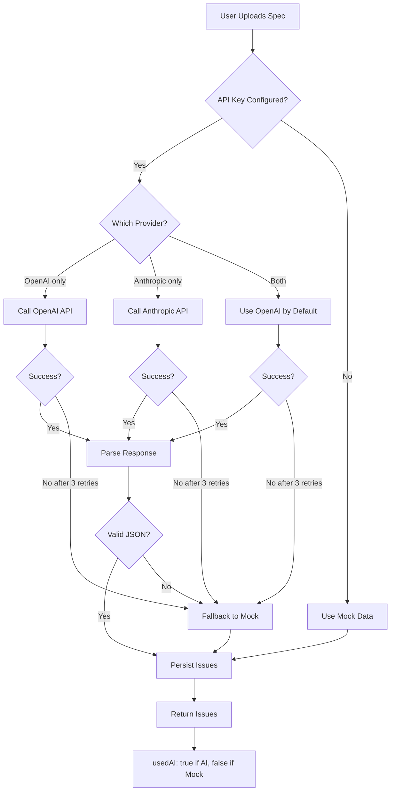
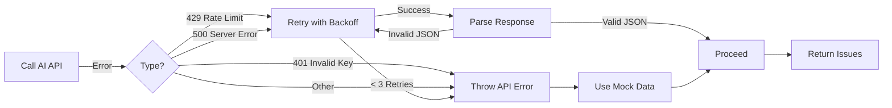
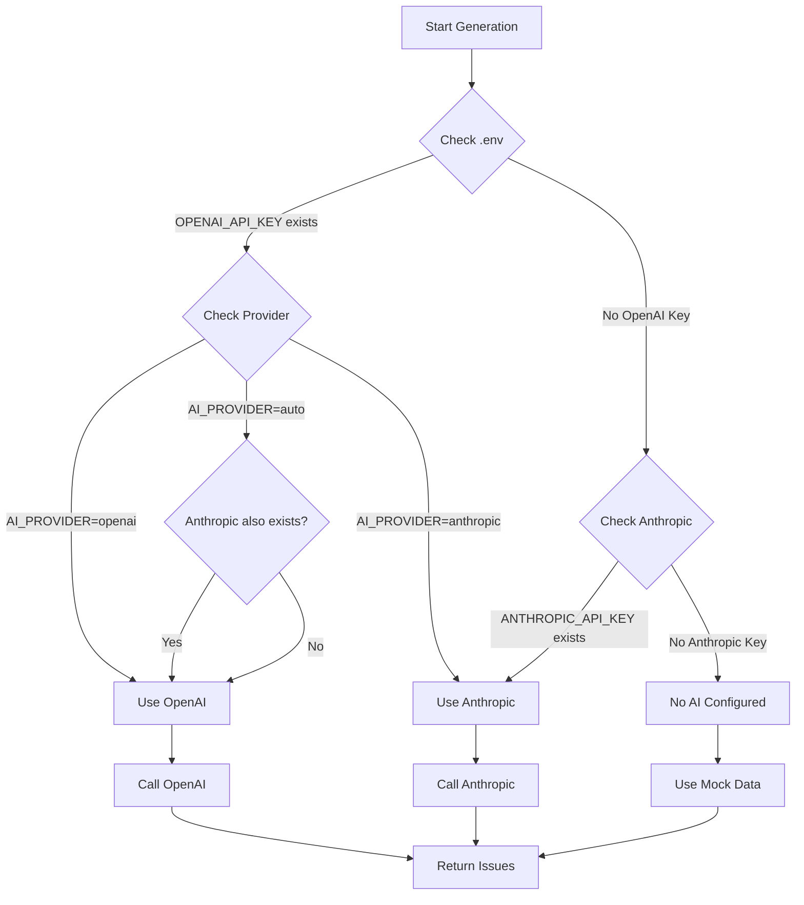
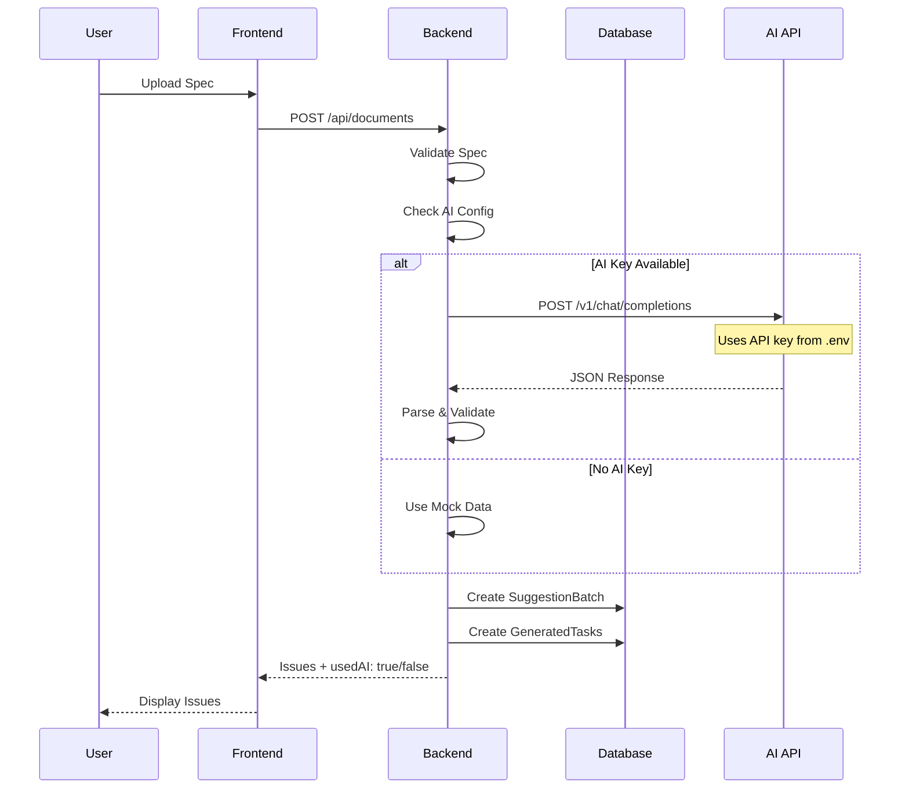

# AI Integration Flow - Visual Guide

## Architecture Overview

```mermaid
flowchart TB
    User[You] -->|Upload Spec| Frontend[Frontend UI]
    Frontend -->|POST /api/documents| Backend[Backend API]

    subgraph Backend["Backend Processing"]
        Backend -->|1. Validate| Validate[Validate Spec]
        Validate -->|2. Check AI| CheckAI{Is AI Key Configured?}

        CheckAI -->|Yes, use AI| AI[AI Service]
        CheckAI -->|No, fallback| Mock[Mock Generator]

        AI -->|3. Call API| API{OpenAI or Anthropic}

        API -->|4. Get Response| Response{JSON Issues}
        Response -->|5. Parse| Parse[Parse & Validate]
        Parse -->|6. Persist| Persist[SuggestionBatch + GeneratedTasks]

        Mock -->|Direct| Persist
        Persist -->|7. Return| Frontend
    end

    Backend -->|Issues + usedAI: true| User
```

## Step-by-Step Process

### Step 1: Upload Specification
```
You (Frontend) → Backend API
POST /api/documents
{
  "project_id": "...",
  "raw_text": "# Your spec...",
  "options": { "useAI": "true" }
}
```

### Step 2: Backend Checks Configuration
```javascript
// In issueGenerator.js
const aiAvailable = isAIAvailable({
  openaiKey: process.env.OPENAI_API_KEY,
  anthropicKey: process.env.ANTHROPIC_API_KEY,
  provider: 'auto'
});

if (aiAvailable) {
  // Use real AI
  result = await generateIssuesWithAI(specText, options);
} else {
  // Fall back to mock
  result = await generateMockIssues(specText);
}
```

### Step 3: Call AI API
```javascript
// In aiService.js
if (selectedProvider === 'openai') {
  response = await fetch('https://api.openai.com/v1/chat/completions', {
    method: 'POST',
    headers: {
      'Authorization': `Bearer ${OPENAI_API_KEY}`
    },
    body: JSON.stringify({
      model: 'gpt-4o',
      messages: [
        { role: 'system', content: SYSTEM_PROMPT },
        { role: 'user', content: specText }
      ]
    })
  });
}
```

### Step 4: Parse & Validate Response
```javascript
// In aiService.js
const parsed = JSON.parse(response);

// Validate structure
if (!parsed.issues || !Array.isArray(parsed.issues)) {
  throw new Error('Invalid response');
}

// Validate each issue
parsed.issues.forEach(issue => {
  assert(issue.type === 'epic' || 'story');
  assert(issue.summary);
  assert(issue.description);
  assert(issue.acceptanceCriteria.length > 0);
});
```

### Step 5: Persist to Database
```javascript
// In issueGenerator.js
const batch = await SuggestionBatch.create({
  document_id: document.id,
  created_by: user.id
});

const tasks = await GeneratedTask.createMany(
  generatedIssues.map(issue => ({
    batch_id: batch.id,
    title: issue.summary,
    description: issue.description,
    status: 'DRAFT',
    generated_payload: issue
  }))
);
```

### Step 6: Return to Frontend
```json
{
  "document": { "id": "...", "status": "Completed" },
  "batch": { "id": "...", "status": "DRAFT" },
  "issues": [
    { "id": "...", "title": "...", "status": "DRAFT" }
  ],
  "usedAI": true,
  "aiMetadata": {
    "provider": "openai",
    "model": "gpt-4o",
    "attempts": 1
  }
}
```

## Decision Tree: AI vs Mock



## Error Handling Flow



## Configuration Decision Flow



## Retry Logic (Exponential Backoff)

```javascript
// In aiService.js
const RETRY_CONFIG = {
  maxRetries: 3,
  initialDelay: 1000,    // 1 second
  maxDelay: 5000,       // 5 seconds
  backoffMultiplier: 2   // Doubles each retry
};

// Retry schedule:
// Attempt 1: Immediate (or 0ms)
// Attempt 2: After 1 second
// Attempt 3: After 2 seconds (1000 * 2^1)
// Attempt 4: After 4 seconds (1000 * 2^2)
```

## Code Flow Diagram



## Data Flow Summary

| Step | Component | Data |
|------|-----------|------|
| 1 | Frontend | Specification text |
| 2 | Backend API | Validated spec |
| 3 | AI Config | API key check |
| 4 | AI Service | HTTP request with API key |
| 5 | AI Provider | JSON response |
| 6 | Backend | Parsed and validated issues |
| 7 | Database | SuggestionBatch + GeneratedTasks |
| 8 | Frontend | Display issues |

## Key Files Involved

```
backend/
├── .env                              # Store API keys here!
├── src/
│   ├── services/
│   │   ├── aiService.js              # AI API calls
│   │   ├── issueGenerator.js         # Orchestrates generation
│   │   └── jiraPublisher.js          # Mocked (P5: real Jira)
│   ├── models/
│   │   ├── SuggestionBatch.js          # Persisted batches
│   │   └── GeneratedTask.js            # Persisted tasks
│   └── routes/
│       └── documents.js               # API endpoint
```

## Environment Variables Summary

```env
# REQUIRED FOR AI (at least one):
OPENAI_API_KEY=sk-your-key-here
ANTHROPIC_API_KEY=sk-ant-your-key-here

# OPTIONAL (use defaults if not set):
OPENAI_MODEL=gpt-4o
ANTHROPIC_MODEL=claude-3-5-sonnet-20241022
AI_PROVIDER=auto
```

## Testing Your Configuration

```bash
# 1. Check if API key is set
grep OPENAI_API_KEY .env

# 2. Start backend
npm start

# 3. Check logs for AI messages
# Look for:
#   [IssueGenerator] Using AI to generate issues...
#   [AI] Calling OpenAI API...
```

## Success Indicators

✅ **Working correctly:**
```
[IssueGenerator] Using AI to generate issues...
[AI] Calling OpenAI API with model: gpt-4o
[IssueGenerator] Generated AI issues: {
  issueCount: 4,
  provider: 'openai',
  model: 'gpt-4o',
  attempts: 1
}
```

❌ **Not working (fallback to mock):**
```
[IssueGenerator] Using mock issue generation
```

## What to Expect

### AI-Generated Issues:
- 4-8 issues per specification
- Mix of epics and stories
- Proper S/M/L/XL sizing
- Testable acceptance criteria
- Clear, actionable summaries

### Quality Indicators:
- Issues map to specification
- No duplicate issues
- Acceptance criteria are specific
- Titles are actionable
- Descriptions provide context

---

**Bottom Line**: Just add an API key to `.env`, restart the backend, and you'll have AI-powered issue generation working! The backend handles everything else automatically. 🚀
