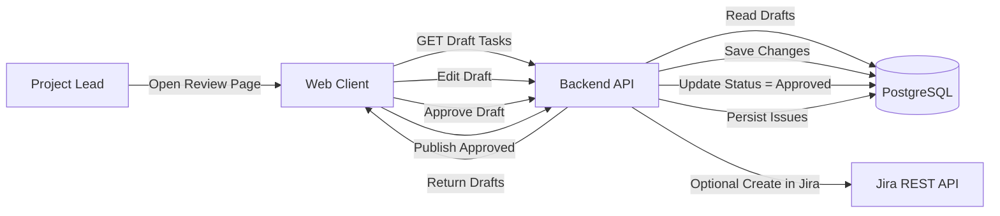
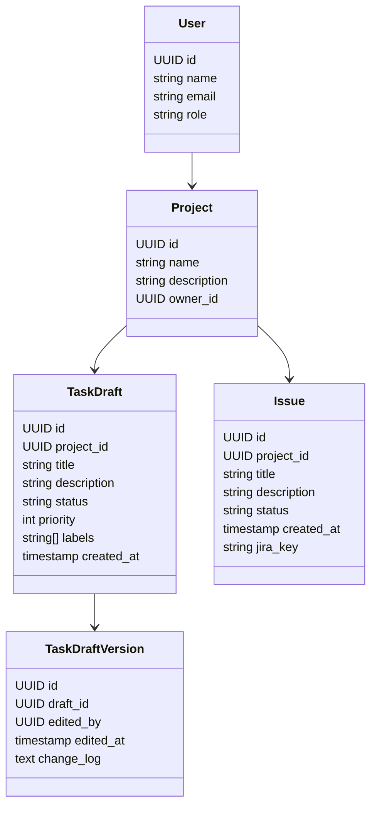
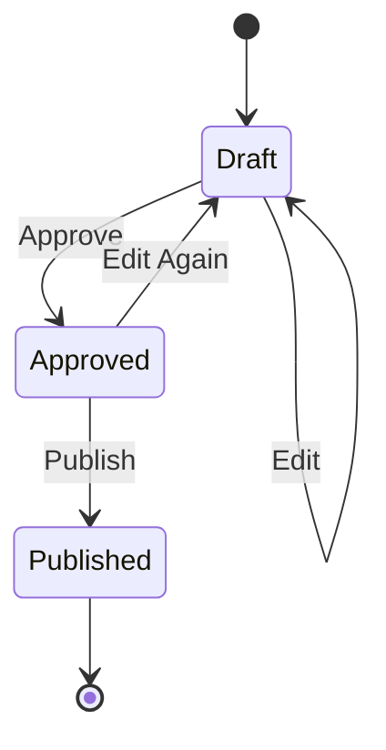
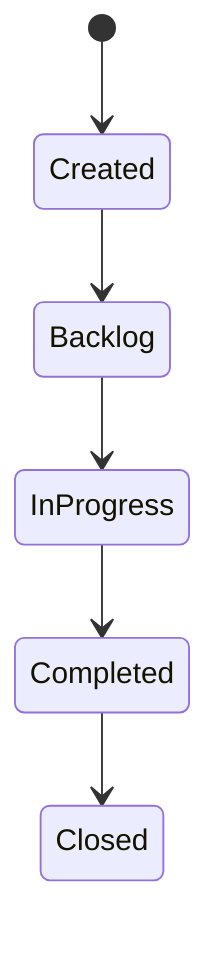
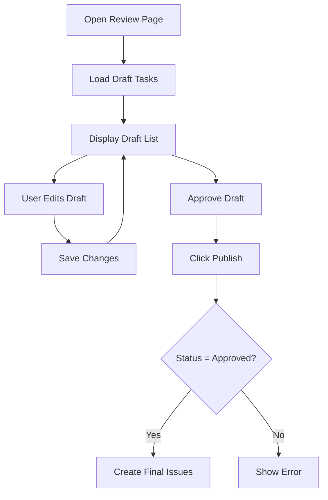

# 1. Header

**Version:** 1.0\
**Date:** February, 2026\
**Project Name:** AI-Enhanced Project Workflow Manager\
**Document Status:** Draft

**Related User Story:**\
As a project lead, I want to review and edit AI-generated tasks before publishing them so that I stay in control of final decisions.

## 2. Architecture

# 2.1 High-Level Architecture Diagram

# 2.2 Component Deployment

- Component Execution Environment
- Web Client Browser
- Backend API Cloud Server / Container
- Database Managed Cloud DB
- LLM Service External Cloud Provider (used in previous story)
- Jira API External REST Service

# 2.3 Information Flow

1) AI-generated draft tasks already exist in the database.
2) User opens the review interface in the Web Client.
3) Backend retrieves draft tasks from the database.
4) User edits draft fields (title, description, priority, labels).
5) Backend stores updated draft and version history.
6) User approves selected drafts.
7) Backend updates draft status to "Approved".
8) User clicks Publish.
9) Backend validates approval and persists drafts as final Issues.
10) Optional: Backend creates Jira issues and stores returned issue keys.

## 3. Class Diagram

## 4. List of Classes

User
- id
- name
- email
- role

Project
- id
- name
- description
- owner_id

TaskDraft
- id
- project_id
- title
- description
- status (Draft / Approved / Published)
- priority
- labels
- created_at

TaskDraftVersion
- id
- draft_id
- edited_by
- edited_at
- change_log

Issue
- id
- project_id
- title
- description
- status
- created_at
- jira_key

## 5. State Diagrams

# 5.1 Task Draft Lifecycle

# 5.2 Issue Lifecycle

## Flow Chart

## Development Risks and Failures

Identified Risks
- Publishing unreviewed tasks
- Losing edit history
- Unauthorized user publishing
- Inconsistent draft and issue data
- Partial publish failures

Mitigation Strategies
- Enforce approval before publish
- Maintain version history table
- Role-Based Access Control (RBAC)
- Transactional database writes
- Clear error feedback in UI

## 8. Technology Stack

Frontend
- React / Next.js
- TypeScript
- TailwindCSS

Backend
- Node.js / Express
- RESTful API architecture

Database
- PostgreSQL
- Prisma ORM

Infrastructure
- Docker
- AWS / GCP / Azure
