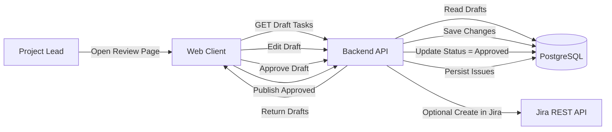
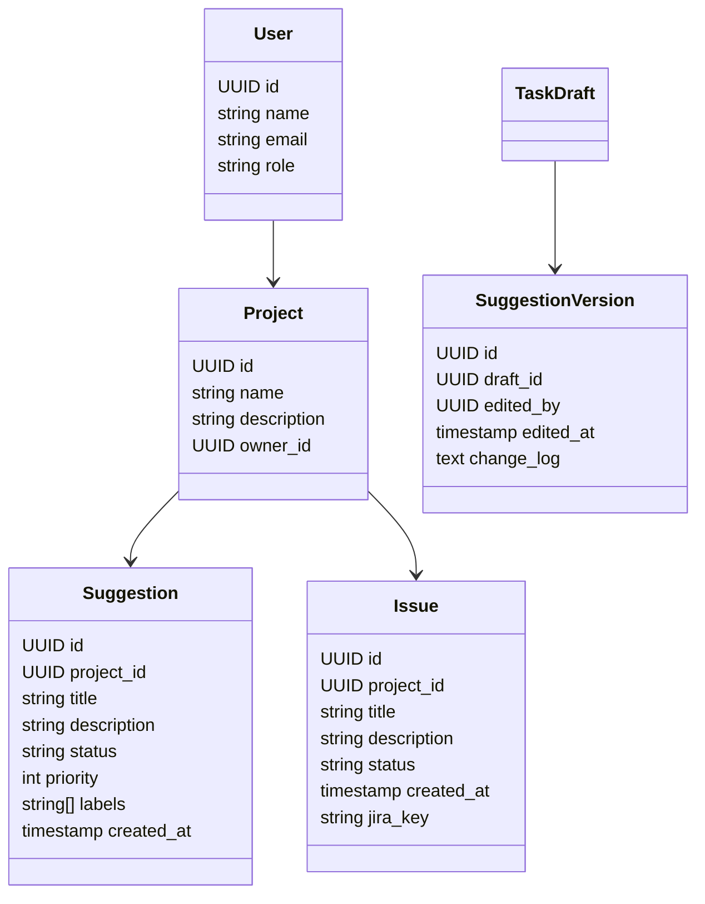
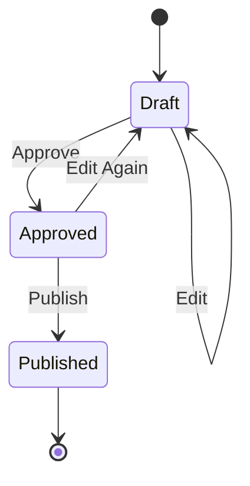
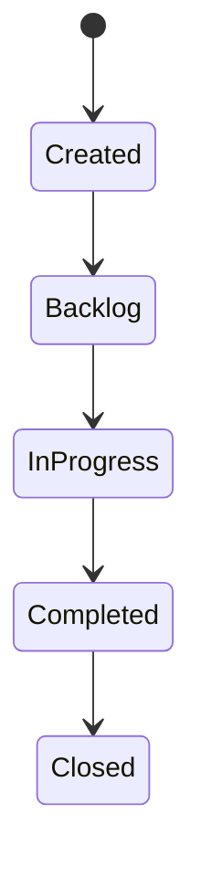
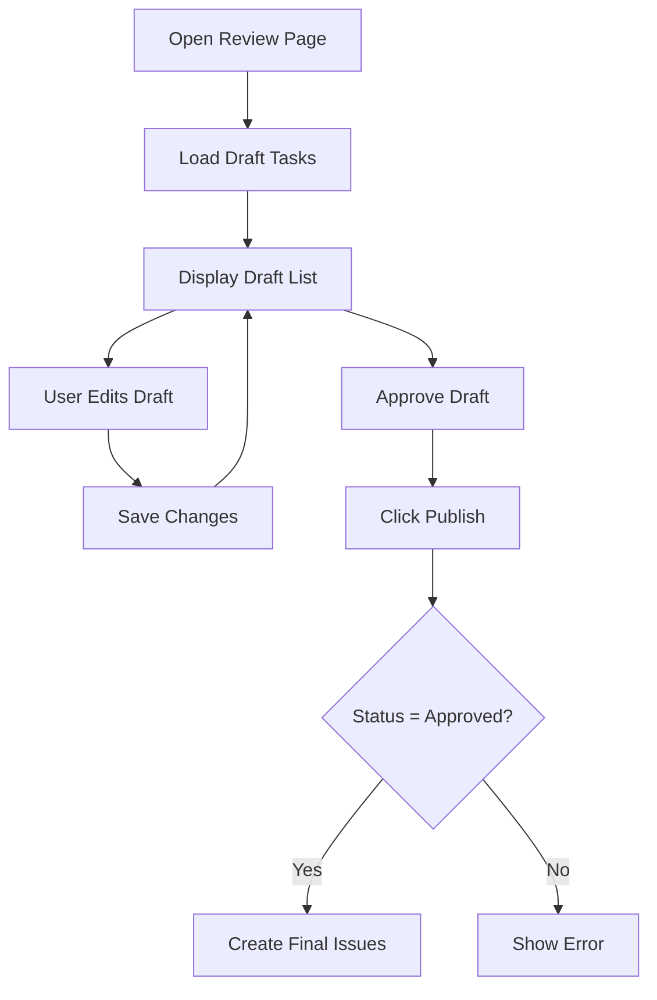

# 1. Header

**Version:** 1.0\
**Date:** February, 2026\
**Project Name:** AI-Enhanced Project Workflow Manager\
**Document Status:** Draft

**Related User Story:**\
As a project lead, I want to review and edit AI-generated tasks before publishing them so that I stay in control of final decisions.

# 2. Architecture

## 2.1 High-Level Architecture Diagram

## 2.2 Component Deployment

- Component Execution Environment
- Web Client Browser
- Backend API Cloud Server / Container
- Database Managed Cloud DB
- LLM Service External Cloud Provider (used in previous story)
- Jira API External REST Service

## 2.3 Information Flow

1) AI-generated draft tasks already exist in the database.
2) User opens the review interface in the Web Client.
3) Backend retrieves draft tasks from the database.
4) User edits draft fields (title, description, priority, labels).
5) Backend stores updated draft and version history.
6) User approves selected drafts.
7) Backend updates draft status to "Approved".
8) User clicks Publish.
9) Backend validates approval and persists drafts as final Issues.
10) Optional: Backend creates Jira issues and stores returned issue keys.

# 3. Class Diagram

# 4. List of Classes

User
- id
- name
- email
- role

Project
- id
- name
- description
- owner_id

Suggestion
- id
- project_id
- title
- description
- status (Draft / Approved / Published)
- priority
- labels
- created_at

SuggestionVersion
- id
- draft_id
- edited_by
- edited_at
- change_log

Issue
- id
- project_id
- title
- description
- status
- created_at
- jira_key

# 5. State Diagrams

## 5.1 Task Draft Lifecycle

## 5.2 Issue Lifecycle

# 6. Flow Chart

# 7. Development Risks and Failures

Identified Risks
- Publishing unreviewed tasks
- Losing edit history
- Unauthorized user publishing
- Inconsistent draft and issue data
- Partial publish failures

Mitigation Strategies
- Enforce approval before publish
- Maintain version history table
- Role-Based Access Control (RBAC)
- Transactional database writes
- Clear error feedback in UI

# 8. Technology Stack

Frontend
- React / Next.js
- TypeScript
- TailwindCSS
- UI editing patterns
    - Form library: React Hook Form (recommended)
    - Rich text: Markdown editor OR simple textarea (MVP)
    - Data fetching: React Query / TanStack Query (recommended)
- Client-side safeguards
    - field length limits
    - unsaved changes indicator (if not autosave)
    - optimistic UI updates + rollback on conflict 

Backend
- Node.js / Express
- RESTful API architecture

Database
- PostgreSQL
- Prisma ORM

AI Integration
- Cloud LLM API
- Structured JSON enforcement
- Promppt versioning
- Output validation + "fail closed" behavior

Security / Infrastructure
- OAuth2 / Auth provider (or NextAuth/Auth0 etc.)
- RBAC middleware
- TLS
- Docker
- Cloud deployment (AWS / GCP / Azure)
- Observability
    - structured logs
    - error tracking (Sentry or equivalent)
    - basic metrics (latency or generate/edit/publish) 

# 9. APIs

## 9.1 Internal API Endpoints (REST)

### Draft Suggestions Lifecycle

#### POST /api/specifications/{spec_id}/suggestions
- Purpose: Generate AI suggestions and persist as a Draft batch (not Issues yet).
- Body (optional):
    - generation_params: { model, temperature, max_tokens, prompt_version }
    - regenerate: boolean (default false)
- Returns: SuggestionBatch (status = DRAFT) + list of suggestions

#### GET /api/specifications/{spec_id}/suggestion-batches
- Purpose: List all batches (drafts, published) for a specification.
- Returns: Array of SuggestionBatchSummary

#### GET /api/suggestion-batches/{batch_id}
- Purpose: Fetch full batch + suggestions + edit metadata.
- Returns: SuggestionBatch + Suggestion[]

#### PATCH /api/suggestions/{suggestion_id}
- Purpose: Edit a single suggestion (title/description/acceptance criteria/labels/estimate/etc.).
- Body: partial update fields + edit_reason (optional)
- Returns: updated Suggestion

#### POST /api/suggestion-batches/{batch_id}/bulk-update
- Purpose: Bulk operations for speed.

- Body options:
    - action: SET_STATUS | ADD_LABEL | REMOVE_LABEL | ASSIGN | SET_PRIORITY | SET_EPIC
    - suggestion_ids: UUID[]
    - payload: action-specific
- Returns: counts updated + updated objects (optional)

#### POST /api/suggestion-batches/{batch_id}/validate
- Purpose: Server-side validation before publishing (required fields, length limits, duplicates, policy checks).
- Returns: { ok: boolean, errors: ValidationError[] }

#### Publish Flow (Gatekeeping)
#### POST /api/suggestion-batches/{batch_id}/publish
- Purpose: Convert approved suggestions into real Issue records (and optionally push to Jira).
- Body:
    - publish_mode: INTERNAL_ONLY | SYNC_TO_JIRA (future-safe)
    - idempotency_key: string (required)
- Behavior:
    - Only suggestions with status=APPROVED are published.
    - Creates Issues in DB with a reference to suggestion_id for traceability.
    - Writes audit events (who published, what changed).
- Returns: { published_issue_ids: UUID[], skipped: UUID[], jira_results?: ... }

#### POST /api/suggestion-batches/{batch_id}/discard
- Purpose: Close the batch without publishing.
- Returns: batch status updated to DISCARDED

#### Collaboration + Audit
#### GET /api/suggestion-batches/{batch_id}/audit
- Purpose: View edit history (who changed what, when).
- Returns: AuditEvent[]

#### POST /api/suggestion-batches/{batch_id}/lock (optional MVP depending on team size)

#### POST /api/suggestion-batches/{batch_id}/unlock
- Purpose: Prevent edit conflicts (simple “checked-out” locking model).
- Returns: lock state

## 9.2 External APIs
- LLM Completion API (same as Story 1, but now store outputs as Draft batches)
- Optional Jira REST API (publish step only; still gated by human approval)

# 10. Public Interfaces

## 10.1 Web UI Screens / Components
### A) “Suggestions Review & Edit” Panel (Core)
- Left pane: list/table of suggestions with quick filters
    - Filters: Status (Draft/Approved/Rejected), Assignee, Priority, Label, Search text
    - Sort: confidence, priority, created_at, last_edited
- Right pane: edit form for selected suggestion
    - Fields:
        - Title
        - Description (rich text or markdown)
        - Acceptance criteria (bullets)
        - Labels/tags
        - Priority (P0–P3)
        - Estimate (story points or hours)
        - Assignee
        - Dependencies (links to other suggestions)
    - Autosave with debounce OR explicit “Save” (choose one; autosave needs stronger audit + conflict handling)

### B) Batch Summary Header (Guardrails)
- Batch status: DRAFT | PUBLISHED | DISCARDED
- “Validate batch” button (shows errors inline)
- “Publish approved tasks” button (disabled until validation passes)
- “Discard draft” button

### C) Diff / History View (High trust feature)
- “View changes” drawer:
    - shows original AI output vs edited version
    - shows editor + timestamp
    - shows edit reason if provided

### D) Publish Confirmation Modal
- Shows count of:
    - Approved → will publish
    - Rejected → won’t publish
    - Draft → won’t publish (must be approved or rejected)

- Requires confirm + optional note

## 10.2 Public API (Future Extension)
If you later expose a public developer API:
- GET /public/suggestion-batches/{id}
- POST /public/suggestion-batches/{id}/publish
 All behind OAuth2 + RBAC + rate limits.

# 11. Data Schemas
## 11.1 New / Updated Database Entities
SuggestionBatch

Represents one AI generation session tied to a specification.
- id: UUID (PK)
- specification_id: UUID (FK)
- status: enum(DRAFT, PUBLISHED, DISCARDED)
- prompt_version: string
- model: string
- created_by: UUID (FK User)
- created_at: timestamp
- published_at: timestamp nullable
- published_by: UUID nullable
- idempotency_key_last_publish: string nullable

### Suggestion (Draft Task)
A single AI-generated task that can be edited before becoming an Issue.
- id: UUID (PK)
- batch_id: UUID (FK SuggestionBatch)
- project_id: UUID (FK Project) (denormalized for queries)
- source: enum(AI, HUMAN_SEEDED) (future)
- status: enum(DRAFT, APPROVED, REJECTED)
- title: string
- description: text
- acceptance_criteria: text[] (or JSONB)
- labels: text[] (or join table)
- priority: enum(P0,P1,P2,P3) nullable
- estimate: integer nullable
- assignee_id: UUID nullable
- confidence_score: float nullable (from AIProcessor)
- generated_payload: JSONB (raw structured output from LLM for traceability)
- last_edited_by: UUID nullable
- last_edited_at: timestamp nullable
- version: integer (increment per edit)

### SuggestionToIssueLink
Traceability mapping after publish.
- suggestion_id: UUID (FK Suggestion)
- issue_id: UUID (FK Issue)
- published_at: timestamp

### AuditEvent
Append-only log of edits and publishing actions.
- id: UUID
- entity_type: enum(SUGGESTION, BATCH)
- entity_id: UUID
- action: enum(CREATE, UPDATE, APPROVE, REJECT, PUBLISH, DISCARD, VALIDATE_FAIL, LOCK, UNLOCK)
- actor_id: UUID
- timestamp: timestamp
- diff: JSONB (field-level before/after)
- reason: text nullable
- ip_hash/user_agent_hash: string nullable (optional)

## 11.2 JSON API Response Schemas (Examples)
Suggestion (API)
{
  "id": "uuid",
  "batch_id": "uuid",
  "status": "APPROVED",
  "title": "Add review screen for AI tasks",
  "description": "…",
  "acceptance_criteria": ["…", "…"],
  "labels": ["ai", "workflow"],
  "priority": "P2",
  "estimate": 3,
  "assignee_id": "uuid-or-null",
  "confidence_score": 0.78,
  "version": 5,
  "last_edited_by": "uuid",
  "last_edited_at": "2026-02-16T12:34:56Z"
}

# 12. Security and Privacy

## 12.1 Security Controls
- OAuth2 authentication (consistent with Story 1)
- RBAC:
    - ProjectLead: can edit/approve/reject/publish
    - Contributor: can view suggestions, maybe comment (optional)
    - Viewer: read-only

- Publish permission is stricter than edit permission (separate capability)
- Idempotent publish via idempotency_key (prevents double-publishing)
- Input validation + output encoding for all editable fields (XSS prevention)
- Rate limiting on generate/regenerate + publish endpoints
- Audit logging is mandatory for edits + publish actions

## 12.2 Privacy Considerations
- Draft suggestions may contain sensitive spec content → treat same as SpecificationDocument
- Store raw LLM response only in generated_payload with restricted access (admin/project lead only) if you want least-privilege
- Support data retention policy:
    - auto-expire discarded batches after N days (config)
    - keep published batches longer for traceability

# 13. Risks to Completion
## 13.1 Technical Risks
- Edit conflict if multiple people edit same suggestion
    - Mitigation: optimistic locking with version checks (reject stale PATCH)
- Publish duplication
    - Mitigation: idempotency key + unique constraint on SuggestionToIssueLink(suggestion_id)
- Validation complexity creep
    - Mitigation: MVP validation = required fields + max lengths + duplicates; add advanced checks later

## 13.2 Operational Risks
- Scope expansion (comments, mentions, realtime collaboration)
    - Mitigation: keep MVP single-editor or simple locking

## 13.3 Team / Semester Risks
- Implementing audit diffs + versioning can be time-consuming
    - Mitigation: start with simple audit “field changed” logs; add full diff later

# 14. Development Risks and Failures
## Identified Dev Risks
- Failure mode: Suggestions are edited but not persisted reliably (lost work)
    - Fix: autosave with server confirmation OR explicit save + “unsaved changes” UI
      
- Failure mode: Publishing creates Issues missing required fields
    - Fix: server-side validation gate + publish pre-check
      
- Failure mode: Hallucinated tasks get published accidentally
    - Fix: default status = DRAFT; require explicit APPROVE before publish
      
- Failure mode: Prompt injection via spec text influences UI content
    - Fix: sanitize displayed content + treat LLM output as untrusted; block script/HTML

- Failure mode: LLM returns malformed JSON
    - Fix: strict schema validation and “generation failed” UX state, do not create a batch unless output passes validation (or store as FAILED batch with errors)

## Mitigation Strategies
- Optimistic concurrency via version
- Idempotent publish + unique constraints
- Strong validation gate
- Mandatory audit events
- Defensive rendering of all AI text

# 15. Modifications to Dev Spec 1 (Dependency Explanation)

Your Story 1 spec currently says: “Suggestions are temporarily held in memory (not persisted). Only approved suggestions are stored.”
To support Story 3’s dependency (review/edit before publishing), Story 1 must be modified so suggestions can exist as persisted drafts without becoming Issues.

## 15.1 Required Changes (Story 1 Architecture + Flow)

Change: Replace “in-memory suggestions” with “persisted draft suggestion batches.”
- Old Step 6: “Suggestions are temporarily held in memory (not persisted).”
- New Step 6: “Suggestions are persisted as a SuggestionBatch in DRAFT state with editable Suggestion records.”

## 15.2 Database / Class Diagram Additions

Add classes/entities:
- SuggestionBatch
- Suggestion
- SuggestionToIssueLink
- AuditEvent

Update relationships:
- SpecificationDocument -> SuggestionBatch (1-to-many)
- SuggestionBatch -> Suggestion (1-to-many)
- Suggestion -> Issue (0/1-to-1 via link table)

## 15.3 State Diagram Updates
Specification lifecycle should include draft review before “Reviewed/Archived”:
- Uploaded → Processing → SuggestionsGenerated → DraftReview → Published/Discarded → Archived

Issue creation must be explicitly tied to publish:
- Approved Suggestion → Publish → Issue Created

## 15.4 API Updates (Story 1 Section 9)
Replace/extend endpoints:
- Keep generation endpoint, but it must create a batch + suggestions in DB.
- Add publish endpoint (or move “POST /api/issues” behind publish gate).
- Ensure POST /api/issues is not callable to create Issues directly from AI without review (or require elevated permission).

## 15.5 Why This Dependency Matters
Story 3 needs:
- a stable draft artifact to edit
- audit/history for accountability
- a publish gate that converts approved drafts into Issues
 None of that is possible if suggestions vanish after refresh or exist only in memory.
