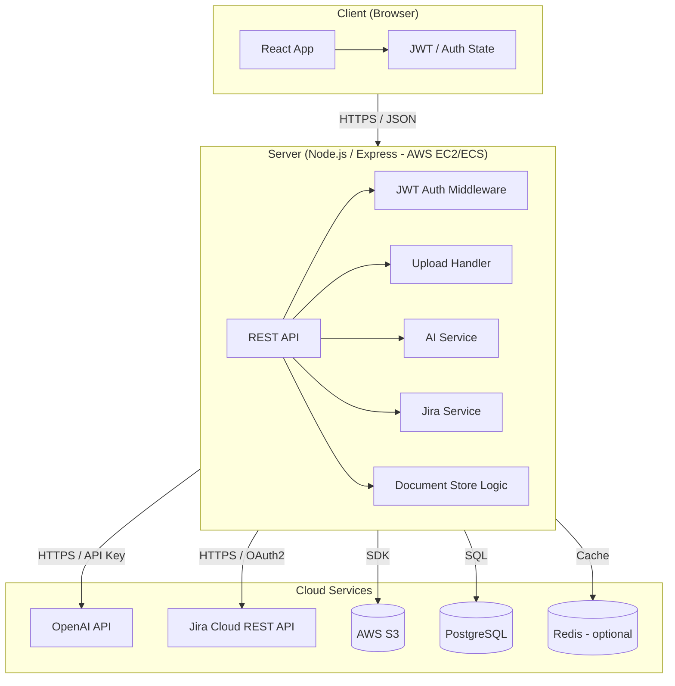
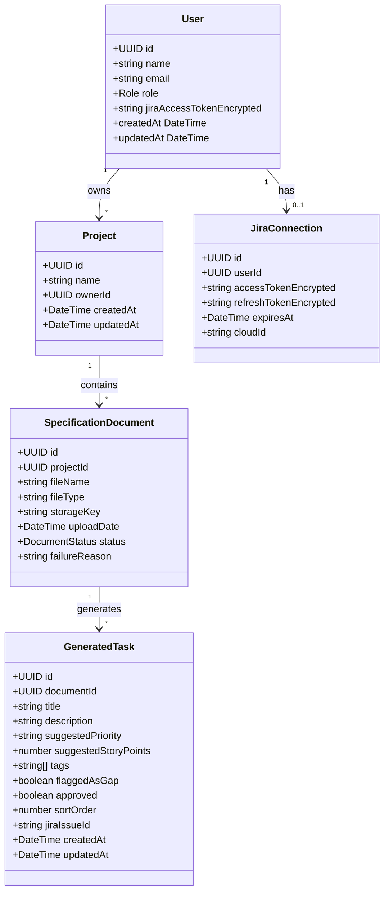
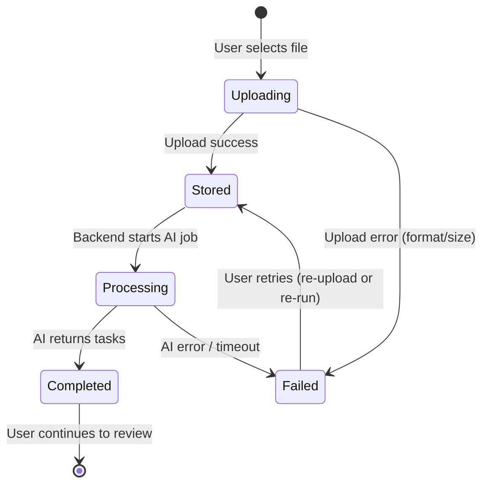
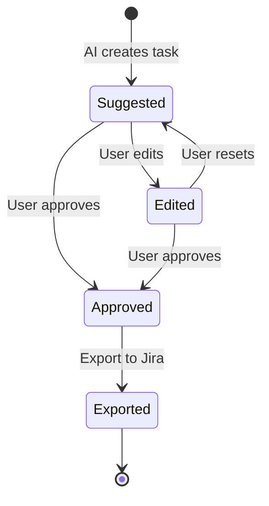
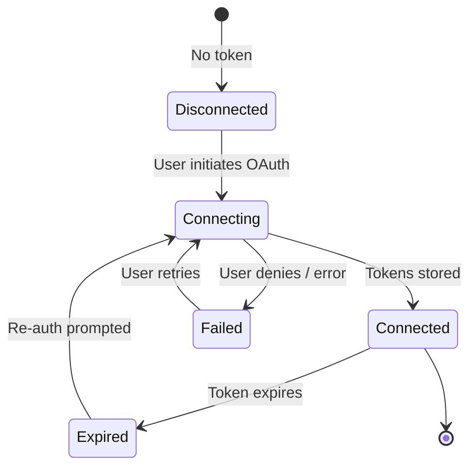
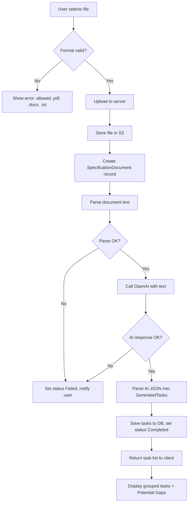
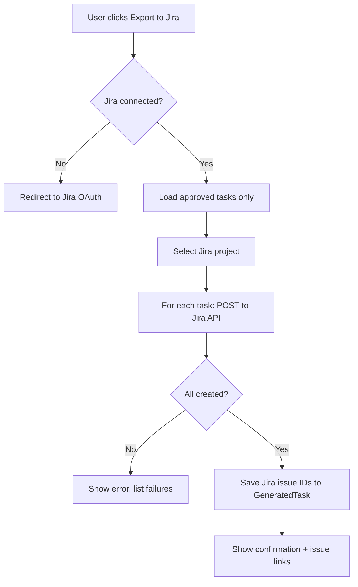

# Development Specification
## Feature: AI-Assisted Specification to Jira Task Generator  

---

## 1. Header

**Version:** 1.0\
**Last Updated:** February, 2026\
**Project Name:** AI-Assisted Specification to Jira Task Generator\
**Document Status:** Draft – Ready for Implementation

**Related User Story:**\
As a project lead, I want the AI to highlight dependencies between tasks so that work is sequenced correctly.

---

## 2. Architecture Diagram

**Where components run:** Client (browser), Server (Node/Express on AWS EC2/ECS), Cloud services (OpenAI, Jira Cloud, AWS S3).  
**Information flows:** User ↔ Frontend (HTTPS); Frontend ↔ Backend API (HTTPS); Backend ↔ OpenAI, Jira, S3, PostgreSQL, optional Redis.



**Information flow summary:**

| From | To | Data / Purpose |
|------|----|----------------|
| Client | Server | JWT, file uploads, task edits, export request |
| Server | Client | Auth tokens, task list, progress, errors, Jira issue IDs |
| Server | OpenAI | Document text (or chunks), prompt for task breakdown |
| OpenAI | Server | Structured task list (JSON) |
| Server | Jira Cloud | OAuth2 token; create issue payloads |
| Jira Cloud | Server | Issue IDs, links, auth errors |
| Server | S3 | Store uploaded file (key by projectId/documentId) |
| Server | PostgreSQL | Users, projects, documents, generated tasks, approval state |
| Server | Redis | Cache AI result keyed by documentId (optional) |

## 2.1. Functional Requirements

| ID | Requirement | Priority |
|----|-------------|----------|
| FR-1 | The system shall allow authenticated users to upload specification documents in .pdf, .docx, and .txt formats. | M |
| FR-2 | The system shall analyze uploaded specification documents using an AI processing engine. | M |
| FR-3 | The system shall generate structured task suggestions from analyzed documents. | M |
| FR-4 | Each generated task shall include title, description, suggested priority, and suggested story points. | M |
| FR-5 | The system shall detect and flag ambiguous, incomplete, or potentially missing requirements. | M |
| FR-6 | The system shall display generated tasks in a structured, grouped format. | M |
| FR-7 | The system shall allow users to edit, delete, or add tasks before export. | M |
| FR-8 | The system shall allow users to approve selected tasks for export. | M |
| FR-9 | The system shall integrate with Jira via API authentication. | M |
| FR-10 | The system shall create Jira issues based on approved tasks in the selected project. | M |
| FR-11 | The system shall display confirmation and issue IDs after successful Jira export. | M |
| FR-12 | The system shall store document analysis results for future retrieval within the project workspace. | S |
| FR-13 | The system shall support version tracking of analyzed specification documents. | S |
| FR-14 | The system shall allow users to regenerate task suggestions after editing the specification. | S |
| FR-15 | The system shall provide explanations for how AI derived each task suggestion. | S |
| FR-16 | The system shall support multi-user collaboration within the same project workspace. | S |
| FR-17 | The system shall allow export to additional formats (e.g., CSV, JSON). | L |
| FR-18 | The system shall support integrations with project management tools other than Jira. | L |
| FR-19 | The system shall allow customization of AI task breakdown rules (e.g., story point estimation method). | L |
| FR-20 | The system shall provide analytics on planning accuracy over time. | L |

*M = Must have, S = Should have, L = Nice to have*

---

## 2.2. Non-Functional Requirements

| Area | Requirement |
|------|-------------|
| **Performance** | Process and generate task suggestions for documents up to 20 pages within 30 seconds under normal load. |
| **Performance** | Support at least 100 concurrent active users without >20% response time degradation. |
| **Performance** | Return UI responses (navigation, edits, task updates) within 2 seconds. |
| **Security** | Require user authentication before document upload, AI processing, or Jira export. |
| **Security** | Encrypt all data in transit using HTTPS (TLS 1.2+). |
| **Security** | Store uploaded documents securely; restrict access to authorized project members. |
| **Security** | Do not retain uploaded documents longer than 30 days unless explicitly saved. |
| **Security** | Store Jira API tokens securely; never expose on client side. |
| **Usability** | Provide clear progress indicators during AI document processing. |
| **Usability** | Allow users to review and edit generated tasks before export. |
| **Usability** | Error messages shall be descriptive and provide resolution guidance. |
| **Usability** | Follow WCAG 2.1 Level AA for readability and navigation. |
| **Compatibility** | Support latest two versions of Chrome, Firefox, Safari, and Edge. |
| **Compatibility** | Be responsive and usable on desktop and tablet. |
| **Compatibility** | Integrate with Jira Cloud via official REST APIs. |
| **Reliability** | Maintain 99% uptime during business hours (8 AM–8 PM EST). |
| **Scalability** | Architecture shall allow horizontal scaling for increased load. |
| **Maintainability** | Follow modular architecture for independent updates to AI and Jira components. |

---

## 3. Class Diagram

**Domain model (backend / shared types):**



## 4. List of classes (implementation-oriented):**

| Class | Layer | Responsibility |
|-------|--------|----------------|
| **User** | Domain / DB | User identity, role, encrypted Jira token reference. |
| **Project** | Domain / DB | Project container; ownerId → User. |
| **SpecificationDocument** | Domain / DB | Uploaded file metadata, storage key, processing status. |
| **GeneratedTask** | Domain / DB | Single AI-generated task; approval flag; optional Jira issue ID after export. |
| **JiraConnection** | Domain / DB | Per-user Jira OAuth2 tokens and cloud ID. |
| **AuthService** | Backend | Login, JWT issue/verify, password/token handling. |
| **UploadService** | Backend | Validate file type/size, stream to S3, create SpecificationDocument, trigger AI. |
| **DocumentParser** | Backend | Extract text from PDF (.pdf), DOCX (.docx), TXT (.txt) using pdf-parse, mammoth, etc. |
| **AITaskService** | Backend | Call OpenAI with parsed text; return structured task list + gaps. |
| **TaskGroupingService** | Backend | Group tasks by feature/module/tags for display. |
| **JiraIntegrationService** | Backend | OAuth2 flow, create issues, map GeneratedTask → Jira issue. |
| **ProjectRepository** | Backend | CRUD for Project, SpecificationDocument, GeneratedTask. |
| **DocumentController** | Backend | REST: upload, status, list documents. |
| **TaskController** | Backend | REST: list/edit/approve tasks, export to Jira. |
| **AuthController** | Backend | REST: login, refresh, Jira connect callback. |
| **Frontend: AuthContext** | Client | Hold user, JWT, login/logout. |
| **Frontend: DocumentUpload** | Client | File picker, progress, error display. |
| **Frontend: TaskList** | Client | Display grouped tasks, inline edit, approve, delete. |
| **Frontend: JiraExport** | Client | Trigger export, show issue IDs/links. |

---

## 5. State Diagrams

### 5.1 Specification Document lifecycle



### 5.2 Generated task (approval)



### 5.3 Jira connection (per user)



---

## 6. Flow Charts

### 6.1 Upload and AI task generation (high-level)



### 6.2 Export to Jira



---

## 7. Development Risks and Failures

| Risk | Impact | Mitigation |
|------|--------|------------|
| **OpenAI API downtime or rate limits** | Task generation fails or is delayed | Retry with backoff; queue long-running jobs; show clear “AI unavailable” message; consider fallback model. |
| **OpenAI cost overrun** | Budget exceeded | Cap tokens per request; limit doc size (e.g. 20 pages); per-user or global monthly quota; alert when near limit. |
| **Jira API changes or breaking changes** | Export fails | Pin supported Jira API version; integration tests against Jira Cloud; monitor deprecation notices. |
| **OAuth2 flow complexity** | Users cannot connect Jira | Use official Jira OAuth docs; store state in signed cookie; clear error messages and retry. |
| **Large or malformed documents** | Parse timeout or crash | Enforce 10 MB and page limit; stream parse; timeout after N seconds; return “document too complex” error. |
| **Incorrect or incomplete AI output** | Low-quality tasks | Structured output (JSON schema); prompt engineering; “Potential Gaps” section; human review always required. |
| **Data loss (DB or S3)** | Lost documents or tasks | Daily DB backups; S3 versioning or cross-region copy; document retention policy. |
| **Token/secret leak** | Unauthorized access | Secrets in env only; rotate keys periodically; revoke Jira tokens on logout. |

---

## 8. Technology Stack

| Layer | Technology | Purpose |
|-------|------------|---------|
| **Frontend** | React 18+ (TypeScript) | UI, state, routing |
| **Frontend** | Tailwind CSS | Styling, responsiveness |
| **Frontend** | Axios | HTTP client to backend API |
| **Frontend** | React Router | Navigation |
| **Backend** | Node.js 20 LTS | Runtime |
| **Backend** | Express | HTTP server, middleware, routes |
| **Backend** | TypeScript | Typing, maintainability |
| **Backend** | OpenAI API (e.g. GPT-4) | Document analysis, task generation |
| **Backend** | Jira Cloud REST API | Create issues, project/metadata |
| **Backend** | JWT | Session/auth tokens |
| **Backend** | pdf-parse | PDF text extraction |
| **Backend** | mammoth | DOCX text extraction |
| **Database** | PostgreSQL 15+ | Users, projects, documents, tasks |
| **Database** | Redis (optional) | Cache AI results by documentId |
| **Storage** | AWS S3 | Uploaded specification files |
| **Infrastructure** | Docker | App and DB containers |
| **Infrastructure** | AWS EC2 / ECS | Compute |
| **Infrastructure** | TLS 1.2+ (HTTPS) | Encryption in transit |

---

## 9. APIs

### 9.1 Internal REST API (Backend ↔ Frontend)

Base URL: `https://api.<domain>/v1` (or relative `/api/v1` behind reverse proxy).  
All endpoints except `/auth/login` and `/auth/register` require header: `Authorization: Bearer <JWT>`.

| Method | Endpoint | Description | Request body | Response |
|--------|----------|-------------|--------------|----------|
| POST | `/auth/login` | Login | `{ email, password }` | `{ token, user: { id, name, email, role } }` |
| POST | `/auth/register` | Register | `{ name, email, password }` | `{ token, user }` |
| GET | `/auth/jira/callback` | Jira OAuth callback (query: code, state) | — | Redirect + set cookies/tokens |
| GET | `/auth/jira/url` | Get Jira OAuth authorization URL | — | `{ url }` |
| GET | `/projects` | List projects for user | — | `{ projects: Project[] }` |
| POST | `/projects` | Create project | `{ name }` | `{ project: Project }` |
| GET | `/projects/:projectId/documents` | List documents in project | — | `{ documents: SpecificationDocument[] }` |
| POST | `/projects/:projectId/documents` | Upload document (multipart/form-data: file) | FormData | `{ document: SpecificationDocument }` (status Processing) |
| GET | `/documents/:documentId` | Get document metadata and status | — | `{ document }` |
| GET | `/documents/:documentId/tasks` | Get generated tasks for document | — | `{ tasks: GeneratedTask[], groupedBy?: string }` |
| PATCH | `/documents/:documentId/tasks/:taskId` | Update task (edit, approve) | `Partial<GeneratedTask>` | `{ task }` |
| POST | `/documents/:documentId/tasks` | Add new task (manual) | `GeneratedTask` (no id) | `{ task }` |
| DELETE | `/documents/:documentId/tasks/:taskId` | Delete task | — | 204 |
| POST | `/documents/:documentId/export-jira` | Export approved tasks to Jira | `{ jiraProjectId?: string }` | `{ created: { taskId, jiraIssueId, link }[], errors?: [] }` |

### 9.2 External APIs (Backend ↔ Cloud)

| API | Purpose | Auth | Key operations |
|-----|---------|------|-----------------|
| **OpenAI API** | Task breakdown from spec text | Server-held API key (env) | Chat/completions with structured output (JSON schema for tasks) |
| **Jira Cloud REST API** | Create issues, project list | OAuth 2.0 (tokens in DB per user) | `POST /rest/api/3/issue`, `GET /rest/api/3/project`, `GET /rest/api/3/myself` |
| **AWS S3** | Store uploaded files | IAM / SDK credentials | PutObject (upload), GetObject (retrieve if needed) |

---

## 10. Public Interfaces

**Public** here means “exposed to the frontend or external systems” (contracts for implementation).

### 10.1 Auth

- **Login request:** `{ email: string, password: string }`
- **Login response:** `{ token: string, user: { id: string, name: string, email: string, role: 'ProjectLead' | 'Developer' } }`
- **JWT payload (server-decoded):** `{ sub: userId, email, role, iat, exp }`

### 10.2 Document upload

- **Request:** `POST /projects/:projectId/documents`, `Content-Type: multipart/form-data`, field name: `file`
- **Response:** `{ document: { id, projectId, fileName, fileType, status: 'Processing' | 'Completed' | 'Failed', uploadDate } }`
- **Allowed types:** `.pdf`, `.docx`, `.txt`; max size 10 MB

### 10.3 Tasks (generated)

- **Task object:** `{ id, documentId, title, description, suggestedPriority, suggestedStoryPoints, tags[], flaggedAsGap, approved, sortOrder, jiraIssueId? }`
- **List response:** `{ tasks: GeneratedTask[], groupedBy?: 'module' | 'feature' | 'tag' }`

### 10.4 Jira export

- **Request:** `POST /documents/:documentId/export-jira`, body optional: `{ jiraProjectId?: string }`
- **Response:** `{ created: { taskId, jiraIssueId, link }[], errors?: { taskId, message }[] }`

---

## 11. Data Schemas

### 11.1 PostgreSQL (core tables)

```sql
-- Users
CREATE TABLE users (
  id UUID PRIMARY KEY DEFAULT gen_random_uuid(),
  name VARCHAR(255) NOT NULL,
  email VARCHAR(255) UNIQUE NOT NULL,
  password_hash VARCHAR(255) NOT NULL,
  role VARCHAR(50) NOT NULL DEFAULT 'ProjectLead',
  created_at TIMESTAMPTZ DEFAULT NOW(),
  updated_at TIMESTAMPTZ DEFAULT NOW()
);

-- Projects
CREATE TABLE projects (
  id UUID PRIMARY KEY DEFAULT gen_random_uuid(),
  name VARCHAR(255) NOT NULL,
  owner_id UUID NOT NULL REFERENCES users(id) ON DELETE CASCADE,
  created_at TIMESTAMPTZ DEFAULT NOW(),
  updated_at TIMESTAMPTZ DEFAULT NOW()
);

-- Specification documents
CREATE TABLE specification_documents (
  id UUID PRIMARY KEY DEFAULT gen_random_uuid(),
  project_id UUID NOT NULL REFERENCES projects(id) ON DELETE CASCADE,
  file_name VARCHAR(512) NOT NULL,
  file_type VARCHAR(20) NOT NULL,
  storage_key VARCHAR(512) NOT NULL,
  upload_date TIMESTAMPTZ DEFAULT NOW(),
  status VARCHAR(20) NOT NULL DEFAULT 'Processing', -- Processing | Completed | Failed
  failure_reason TEXT,
  created_at TIMESTAMPTZ DEFAULT NOW(),
  updated_at TIMESTAMPTZ DEFAULT NOW()
);

-- Generated tasks
CREATE TABLE generated_tasks (
  id UUID PRIMARY KEY DEFAULT gen_random_uuid(),
  document_id UUID NOT NULL REFERENCES specification_documents(id) ON DELETE CASCADE,
  title VARCHAR(500) NOT NULL,
  description TEXT,
  suggested_priority VARCHAR(20),
  suggested_story_points INT,
  tags TEXT[] DEFAULT '{}',
  flagged_as_gap BOOLEAN DEFAULT FALSE,
  approved BOOLEAN DEFAULT FALSE,
  sort_order INT DEFAULT 0,
  jira_issue_id VARCHAR(100),
  created_at TIMESTAMPTZ DEFAULT NOW(),
  updated_at TIMESTAMPTZ DEFAULT NOW()
);

-- Jira connection (per user)
CREATE TABLE jira_connections (
  id UUID PRIMARY KEY DEFAULT gen_random_uuid(),
  user_id UUID UNIQUE NOT NULL REFERENCES users(id) ON DELETE CASCADE,
  access_token_encrypted TEXT NOT NULL,
  refresh_token_encrypted TEXT,
  expires_at TIMESTAMPTZ,
  cloud_id VARCHAR(100),
  created_at TIMESTAMPTZ DEFAULT NOW(),
  updated_at TIMESTAMPTZ DEFAULT NOW()
);

-- Indexes for common queries
CREATE INDEX idx_spec_docs_project ON specification_documents(project_id);
CREATE INDEX idx_spec_docs_status ON specification_documents(status);
CREATE INDEX idx_tasks_document ON generated_tasks(document_id);
CREATE INDEX idx_tasks_approved ON generated_tasks(document_id, approved) WHERE approved = TRUE;
CREATE INDEX idx_projects_owner ON projects(owner_id);
```

### 11.2 OpenAI response shape (structured output)

```ts
interface AITaskOutput {
  tasks: {
    title: string;
    description: string;
    suggestedPriority: 'Highest' | 'High' | 'Medium' | 'Low' | 'Lowest';
    suggestedStoryPoints: number;
    tags: string[];
    flaggedAsGap: boolean;
  }[];
}
```

### 11.3 Jira issue creation payload (Jira REST API)

- **Endpoint:** `POST /rest/api/3/issue`
- **Body:** `{ fields: { project: { key }, summary, description, issuetype: { id }, priority?: { id }, customfield_xxxxx?: number } }` (story points if custom field known)

---

## 12. Security and Privacy

| Concern | Measure |
|---------|---------|
| **Authentication** | Passwords hashed (e.g. bcrypt); JWT with short expiry (e.g. 1 h), refresh token optional. |
| **Authorization** | Every document/task/project request validated against authenticated user (project membership / ownership). |
| **Transport** | HTTPS only (TLS 1.2+); no API keys or tokens in query params. |
| **Secrets** | OpenAI API key and Jira client secret in server env only; never sent to client. |
| **Jira tokens** | Stored encrypted (e.g. AES-256) in DB; decrypted only in backend when calling Jira. |
| **File upload** | Validate MIME type and extension; max 10 MB; virus scan optional for MVP. |
| **Data retention** | Delete or anonymize uploaded files and AI inputs after 30 days unless user explicitly “saves” (retain per policy). |
| **Access control** | Project-scoped: only project owner (and future collaborators) can read/export documents and tasks. |
| **Audit** | Log auth events and export actions (who, when, documentId) for security review. |
| **Privacy** | No PII sent to OpenAI beyond spec content; document content not shared with other tenants. |

---

## 13. Risks to Completion

| Risk | Description | Mitigation |
|------|-------------|------------|
| **Scope creep** | Stakeholders request Jira Server, auto-assignment, etc. | Strict out-of-scope list; phase 2 backlog. |
| **AI quality** | Tasks not useful or inconsistent | Iterate prompts; add examples; accept “review required” as MVP. |
| **Jira project/field mapping** | Different Jira instances have different custom fields | MVP: support default issue type and standard fields; document limitations; add config in Phase 2. |
| **Timeline** | 30-second AI SLA hard to meet for large docs | Chunk documents; stream progress; set expectation “up to 30 s” with progress indicator. |
| **Resource availability** | Single developer or part-time team | Prioritize M over S/L; cut optional features if needed. |
| **Third-party dependency** | OpenAI or Jira ToS or pricing change | Abstract AI and Jira behind interfaces; plan for alternative provider if critical. |

---

## 15. Out of Scope (for this story)

- AI does not auto-assign tasks to team members.
- AI does not set sprint timelines or deadlines.
- System does not modify existing Jira issues (only create new ones).
- No Jira Server (on-premise); Jira Cloud only.
- No guarantee of correctness or completeness of AI-generated tasks.
- No project-level timeline estimation beyond per-task story points.
- No non-English spec documents in MVP.
- No real-time collaborative editing of AI-generated tasks.
- No automatic sprint planning or backlog optimization.
- No integrations other than Jira in this story.
- No historical analytics or performance tracking.
- Documents not stored permanently unless user explicitly saves.
- AI does not generate architecture diagrams, test cases, or code.

---

## 16. Open Questions / Assumptions

**Assumptions:** Users have an active Jira Cloud account and permission to create issues; specs are structured English; documents contain enough detail for task extraction; OpenAI availability is acceptable; MVP user base is small; project leads prefer review before export; no HIPAA/PCI data in docs.

**Open questions:** Sub-tasks under parent stories? Story point methodology (Fibonacci vs T-shirt)? Explainability level for AI tasks? Customization of AI granularity? Audit logs for AI decisions? Max acceptable processing time? Store prompts/outputs for compliance? Data residency (EU vs US)? Monthly AI budget? Phase 2 tools (e.g. GitHub, Linear)?

---

*Document version 1.0. Update as the story is refined or implemented.*
