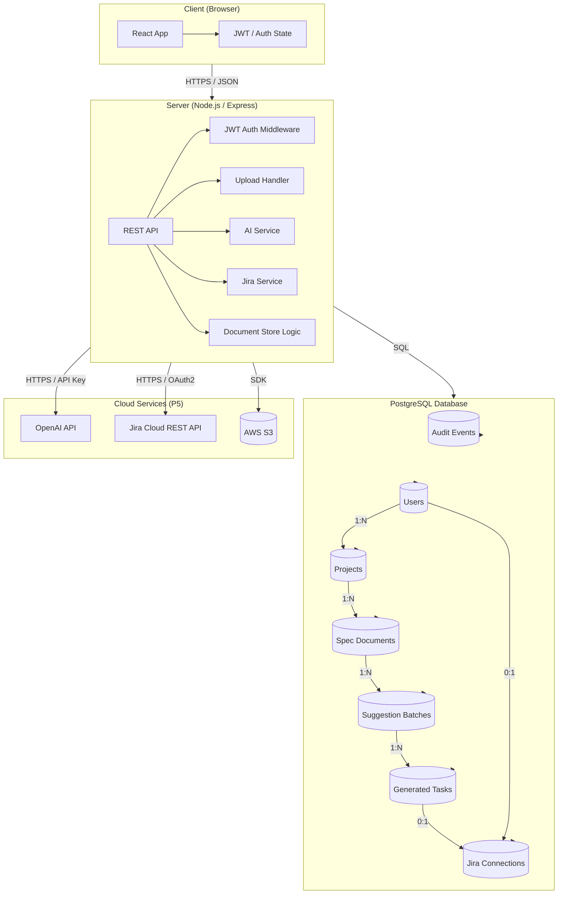
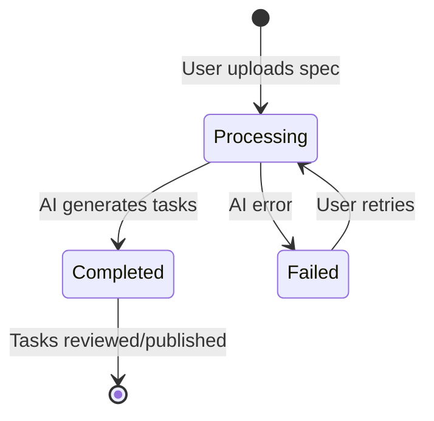
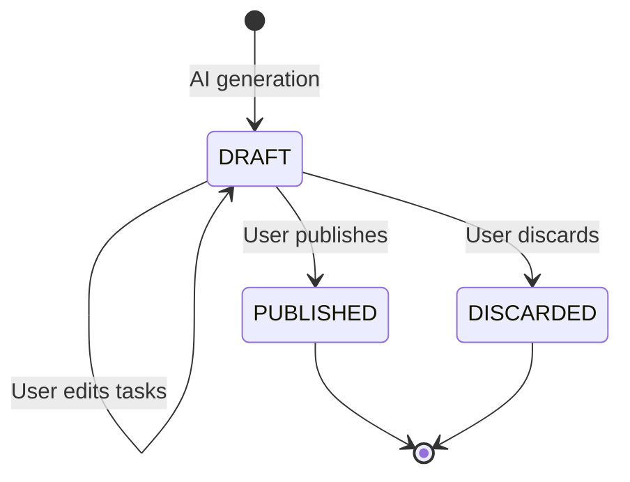
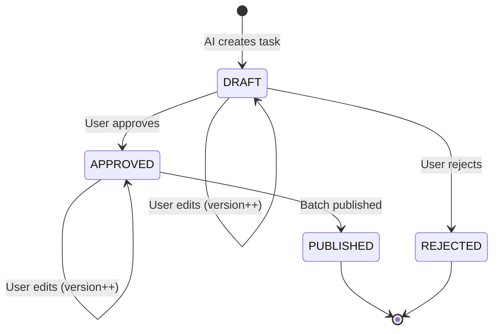
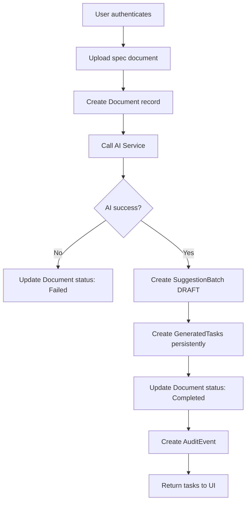
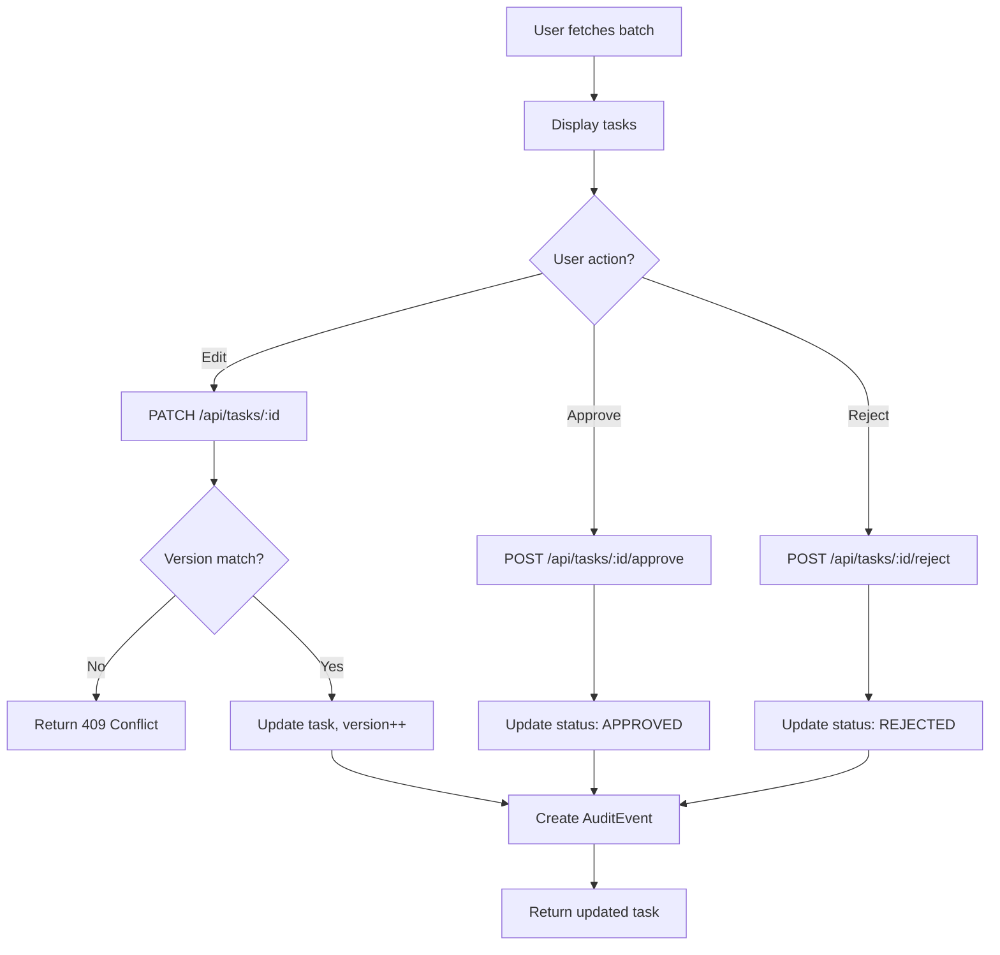
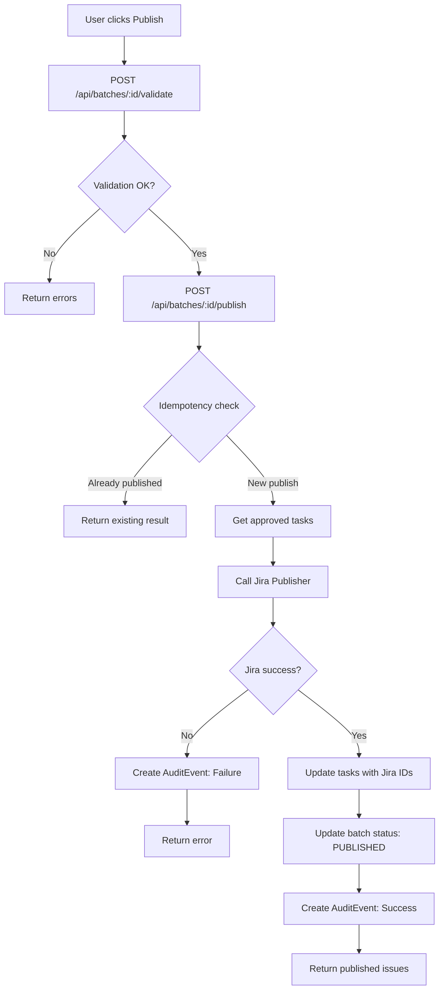

# Harmonized Development Specification - Backend Architecture

## 1. Header

**Version:** 2.0 (Harmonized for P4)
**Date:** March, 2026
**Project Name:** AI-Enhanced Project Workflow Manager
**Document Status:** Final

**Related User Stories:**
- **US1**: As a project lead, I want the AI to automatically break a specification into suggested Jira issues so that I save time on manual task creation.
- **US2**: As a project lead, I want to review and edit AI-generated tasks before publishing them so that I stay in control of final decisions.

## 2. Architecture

### 2.1 High-Level Architecture Diagram



### 2.2 Component Deployment

| Component | Execution Environment |
|-----------|---------------------|
| Web Client | Browser |
| Backend API | Cloud Server / Container |
| Database | PostgreSQL (Managed Cloud DB) |
| LLM Service | External Cloud Provider (P5) |
| Jira API | External REST Service (P5) |
| File Storage | Cloud Object Storage (P5) |

### 2.3 Information Flow (Harmonized for US1 + US2)

**US1 Flow (AI Breakdown):**
1. User authenticates with JWT
2. User uploads specification document
3. Backend validates and stores document in database
4. Backend calls AI service (mocked in P4, real in P5)
5. AI returns structured issue suggestions
6. Backend persists suggestions as **SuggestionBatch** (DRAFT status) with **GeneratedTask** records
7. **Critical**: Suggestions are persisted in database, NOT in-memory (fixes dev-spec-1 issue)
8. User can view generated tasks

**US2 Flow (Review/Edit/Publish):**
1. User fetches suggestion batch and tasks from database
2. User edits tasks (optimistic locking with version field)
3. Backend updates task records and creates audit events
4. User approves/rejects tasks (update status field)
5. Backend validates batch before publishing (required fields, approved tasks exist)
6. User publishes batch with idempotency key
7. Backend publishes approved tasks to Jira (mocked in P4, real in P5)
8. Backend updates batch status to PUBLISHED
9. Backend stores Jira issue IDs in task records

### 2.4 Key Design Decisions

**Why Persisted Suggestion Batches?**
- US2 (review/edit) requires stable storage
- In-memory storage violates P4 requirement for stable storage
- Enables audit trail and version history
- Supports concurrent users without data loss

**Why Optimistic Locking?**
- Multiple users may edit same batch
- Version field prevents conflicts
- 409 error prompts user to refresh

**Why Idempotent Publishing?**
- Network failures can cause duplicate publishes
- Idempotency key ensures one publish per request
- Batch stores last published idempotency key

## 3. Class Diagram (Harmonized)

```mermaid
classDiagram
    class User {
        +UUID id
        +string name
        +string email
        +string password_hash
        +string role
        +DateTime created_at
        +DateTime updated_at
        +verifyPassword(password) boolean
        +create(data) Promise~User~
        +findById(id) Promise~User~
        +findByEmail(email) Promise~User~
    }

    class Project {
        +UUID id
        +string name
        +string description
        +UUID owner_id
        +DateTime created_at
        +DateTime updated_at
        +create(data) Promise~Project~
        +findById(id) Promise~Project~
        +findByOwner(ownerId) Promise~Project[]~
        +getDocuments() Promise~Document[]~
    }

    class SpecificationDocument {
        +UUID id
        +UUID project_id
        +string file_name
        +string file_type
        +string storage_key
        +text raw_text
        +DateTime upload_date
        +string status
        +text failure_reason
        +create(data) Promise~Document~
        +updateStatus(status, failureReason) Promise~Document~
        +getSuggestionBatches() Promise~Batch[]~
        +getLatestCompletedBatch() Promise~Batch~
    }

    class SuggestionBatch {
        +UUID id
        +UUID document_id
        +string status
        +string prompt_version
        +string model
        +UUID created_by
        +DateTime created_at
        +DateTime published_at
        +UUID published_by
        +string idempotency_key_last_publish
        +create(data) Promise~Batch~
        +findById(id) Promise~Batch~
        +getTasks() Promise~Task[]~
        +getApprovedTasks() Promise~Task[]~
        +publish(publishedBy, idempotencyKey) Promise~Result~
        +discard() Promise~boolean~
        +validate() Promise~Validation~
    }

    class GeneratedTask {
        +UUID id
        +UUID batch_id
        +UUID project_id
        +string source
        +string task_type
        +string title
        +string description
        +text[] acceptance_criteria
        +string suggested_priority
        +int suggested_story_points
        +string size
        +string[] tags
        +boolean flagged_as_gap
        +float confidence_score
        +string status
        +int sort_order
        +string jira_issue_id
        +string jira_issue_key
        +int version
        +UUID last_edited_by
        +DateTime last_edited_at
        +JSONB generated_payload
        +DateTime created_at
        +DateTime updated_at
        +create(data) Promise~Task~
        +createMany(data[]) Promise~Task[]~
        +findById(id) Promise~Task~
        +update(updates, expectedVersion) Promise~Task~
        +approve(editedBy) Promise~Task~
        +reject(editedBy) Promise~Task~
    }

    class AuditEvent {
        +UUID id
        +string entity_type
        +UUID entity_id
        +string action
        +UUID actor_id
        +DateTime timestamp
        +JSONB diff
        +text reason
        +string request_id
        +create(data) Promise~AuditEvent~
        +findByEntity(type, id) Promise~AuditEvent[]~
        +findByActor(actorId) Promise~AuditEvent[]~
    }

    User "1" --> "*" Project : owns
    Project "1" --> "*" SpecificationDocument : contains
    SpecificationDocument "1" --> "*" SuggestionBatch : generates
    SuggestionBatch "1" --> "*" GeneratedTask : contains
    User "1" --> "*" SuggestionBatch : creates
    User "1" --> "0..1" JiraConnection : has
    GeneratedTask --> AuditEvent : logged by
```



## 4. State Diagrams

### 4.1 Document Lifecycle



### 4.2 Batch Lifecycle (US2)



### 4.3 Task Lifecycle (US2)



## 5. Flow Charts

### 5.1 US1: Upload and AI Generation



### 5.2 US2: Review, Edit, Approve



### 5.3 US2: Validate and Publish



## 6. Technology Stack

### Backend

| Component | Technology | Purpose |
|-----------|------------|---------|
| **Runtime** | Node.js 20+ | JavaScript runtime |
| **Framework** | Express.js | HTTP server, middleware, routes |
| **Database** | PostgreSQL 15+ | Persistent data storage |
| **Database Client** | pg | PostgreSQL connection pool |
| **Authentication** | JWT + bcryptjs | Token management, password hashing |
| **UUID** | uuid | Unique ID generation |

### AI Integration (P5)

| Component | Technology | Purpose |
|-----------|------------|---------|
| **OpenAI** | openai | GPT-4 API |
| **Anthropic** | @anthropic-ai/sdk | Claude API |

### External Services (P5)

| Component | Technology | Purpose |
|-----------|------------|---------|
| **Jira Cloud** | REST API | Issue creation |
| **AWS S3** | AWS SDK | File storage |

## 7. API Endpoints (Harmonized)

### Authentication

| Method | Endpoint | Description | Auth |
|--------|----------|-------------|-------|
| POST | /api/auth/register | Register user | No |
| POST | /api/auth/login | Login user | No |
| POST | /api/auth/refresh | Refresh token | No |
| GET | /api/auth/me | Get current user | Yes |

### Projects

| Method | Endpoint | Description | Auth |
|--------|----------|-------------|-------|
| POST | /api/projects | Create project | Yes |
| GET | /api/projects | List user's projects | Yes |
| GET | /api/projects/:id | Get project | Yes |
| PATCH | /api/projects/:id | Update project | Yes |
| DELETE | /api/projects/:id | Delete project | Yes |

### Documents (US1)

| Method | Endpoint | Description | Auth |
|--------|----------|-------------|-------|
| POST | /api/documents | Upload spec + generate tasks | Yes |
| GET | /api/documents/:id | Get document | Yes |
| GET | /api/documents/:id/batches | Get batches for document | Yes |
| GET | /api/projects/:projectId/documents | Get docs for project | Yes |

### Tasks (US2)

| Method | Endpoint | Description | Auth |
|--------|----------|-------------|-------|
| GET | /api/tasks/batches/:batchId | Get tasks in batch | Yes |
| GET | /api/tasks/:taskId | Get task | Yes |
| PATCH | /api/tasks/:taskId | Edit task (optimistic lock) | Yes |
| POST | /api/tasks/:taskId/approve | Approve task | Yes |
| POST | /api/tasks/:taskId/reject | Reject task | Yes |
| POST | /api/tasks/batches/:batchId/bulk-update | Bulk approve/reject | Yes |
| POST | /api/tasks/batches/:batchId/validate | Validate before publish | Yes |
| POST | /api/tasks/batches/:batchId/publish | Publish approved tasks | Yes |
| POST | /api/tasks/batches/:batchId/discard | Discard batch | Yes |

### Health

| Method | Endpoint | Description | Auth |
|--------|----------|-------------|-------|
| GET | /api/health | Health check | No |

## 8. Data Schemas

### 8.1 PostgreSQL Tables

See `backend/src/database/schema.sql` for complete DDL.

### 8.2 Key Relationships

- User 1:N Projects
- Project 1:N SpecificationDocuments
- SpecificationDocument 1:N SuggestionBatches
- SuggestionBatch 1:N GeneratedTasks
- User 0:1 JiraConnections
- GeneratedTask 0:1 JiraIssue (via jira_issue_id)

### 8.3 Indexes

Optimized for common queries:
- `idx_projects_owner`: Project queries by owner
- `idx_spec_docs_project`: Document queries by project
- `idx_suggestion_batches_status`: Batch queries by status
- `idx_tasks_batch`: Task queries by batch
- `idx_tasks_approved`: Approved tasks (WHERE clause)
- `idx_audit_events_entity`: Audit queries by entity

## 9. Security and Privacy

### 9.1 Security Controls

- JWT authentication with 1-hour access tokens
- Refresh tokens with 7-day expiry
- Passwords hashed with bcrypt (10 rounds)
- Role-based access control (ProjectLead, Developer)
- Project ownership validation
- Optimistic locking for concurrent edits
- Input validation and sanitization
- SQL injection prevention (parameterized queries)
- CORS configuration
- Helmet security headers

### 9.2 Privacy Considerations

- Specifications may contain proprietary IP
- Passwords never stored in plain text
- AI inputs sent to external API (P5)
- Audit log tracks all access
- Data retention policy configurable

## 10. Concurrency and Scalability

### 10.1 Concurrency Support

**Supports 10 simultaneous users** through:

1. **Connection Pooling**: 20 PostgreSQL connections
2. **Optimistic Locking**: Version field on tasks
3. **Request Queue**: Connection pool manages requests
4. **Idempotency**: Safe retry of publish operations

### 10.2 Performance Targets

- API response time: < 2 seconds
- AI generation time: < 30 seconds (P5)
- Database query time: < 100ms
- Support 10 concurrent users without degradation

## 11. AWS Deployment (P5)

### 11.1 Infrastructure Components

| Component | AWS Service |
|-----------|-------------|
| Compute | EC2 or ECS |
| Database | RDS for PostgreSQL |
| Storage | S3 for document files |
| Load Balancer | ALB (optional) |
| Monitoring | CloudWatch |

### 11.2 Environment Variables

Production `.env`:
```env
NODE_ENV=production
PORT=3001

DB_HOST=your-rds-endpoint.rds.amazonaws.com
DB_PORT=5432
DB_NAME=ai_spec_breakdown
DB_USER=postgres
DB_PASSWORD=secure-password

JWT_SECRET=very-secure-random-string

OPENAI_API_KEY=sk-...
ANTHROPIC_API_KEY=sk-ant-...

JIRA_BASE_URL=https://your-domain.atlassian.net
JIRA_EMAIL=your-email@example.com
JIRA_API_TOKEN=your-token
JIRA_PROJECT_KEY=ABC
```

## 12. Development Risks and Failures

### 12.1 Identified Risks

| Risk | Impact | Mitigation |
|------|--------|------------|
| Database connection failure | Service unavailable | Connection pool, retry logic |
| Concurrent task edits | Data conflicts | Optimistic locking |
| Duplicate publish | Duplicate Jira issues | Idempotency key |
| AI service downtime | Task generation fails | Mock fallback (P4), retry (P5) |
| Jira API error | Publish fails | Transaction rollback, audit log |
| Token expiration | Unauthorized access | Refresh token flow |

### 12.2 Mitigation Strategies

- Connection pooling with health checks
- Optimistic locking with version field
- Idempotent publish operations
- Transactional database writes
- Comprehensive error handling
- Audit logging for all operations

## 13. Testing Strategy

### 13.1 Unit Tests

- Model methods (CRUD operations)
- Service logic (auth, AI generation)
- Middleware (auth, error handling)

### 13.2 Integration Tests

- API endpoints with database
- Authentication flow
- Document upload and generation
- Task review, edit, approve, reject
- Batch validation and publish

### 13.3 End-to-End Tests

- Complete user workflows
- Error recovery
- Concurrency scenarios

## 14. Documentation Deliverables

### 14.1 For P4

1. ✅ Harmonized development spec (this document)
2. ✅ Backend architecture diagram
3. ✅ Module specifications
4. ✅ Database schema
5. ✅ API documentation
6. ✅ README with startup/stop/reset instructions

### 14.2 For P5

1. AWS deployment guide
2. Real AI integration steps
3. Real Jira integration steps
4. S3 file storage implementation

## 15. Summary

This harmonized specification defines a **single, unified backend** that supports both US1 (AI breakdown) and US2 (review/edit before publishing) through:

- **Persistent storage**: PostgreSQL database replaces in-memory storage
- **Suggestion batches**: Persist AI-generated tasks as drafts
- **Version tracking**: Optimistic locking for concurrent edits
- **Idempotent publishing**: Safe retry of publish operations
- **Audit logging**: Complete traceability of all changes
- **10 concurrent users**: Connection pooling and request management

The backend is production-ready for P4 deployment and will be enhanced in P5 with real AI and Jira integration.
