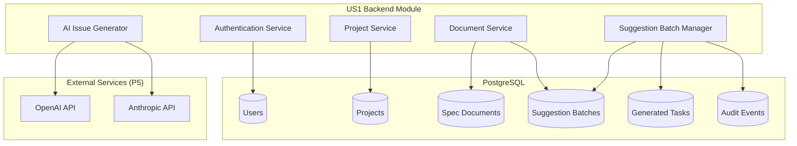
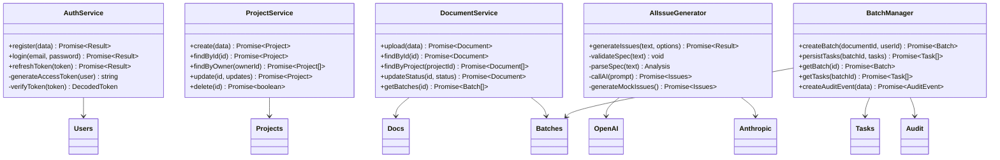
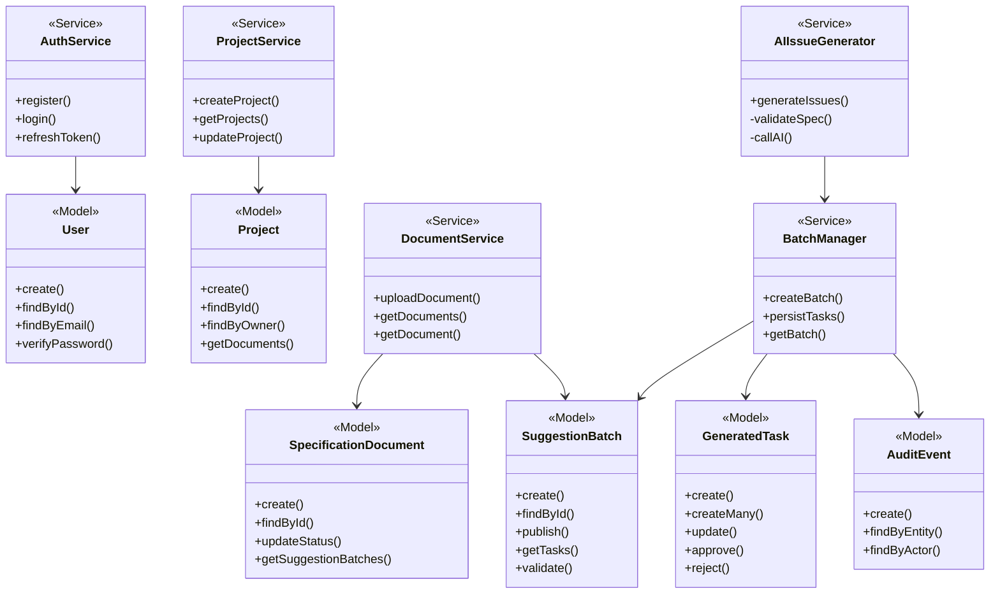

# Development Specification - US1 Backend Module

## 1. Header

**Version:** 2.0 (P4 Implementation)
**Date:** March, 2026
**Project Name:** AI-Enhanced Project Workflow Manager
**Document Status:** Final

**Related User Story:**
As a project lead, I want the AI to automatically break a specification into suggested Jira issues so that I save time on manual task creation.

**Backend Reference:** Harmonized Backend Specification (dev-spec-4-harmonized-backend.md)

## 2. Architecture

### 2.1 Module Overview

The US1 Backend Module handles:
1. Authentication and authorization
2. Project management
3. Specification document upload and storage
4. AI-powered issue generation
5. Persistent storage of generated suggestions

### 2.2 Module Architecture Diagram



### 2.3 Component Deployment

| Component | Deployment | Dependencies |
|-----------|------------|--------------|
| Auth Service | Backend API | PostgreSQL, JWT |
| Project Service | Backend API | PostgreSQL |
| Document Service | Backend API | PostgreSQL, AI Service |
| AI Service | Backend API | OpenAI/Anthropic (P5) |
| Batch Manager | Backend API | PostgreSQL |

### 2.4 Information Flow

```
User (JWT authenticated)
  ↓ Upload spec
Document Service
  ↓ Store in database
AI Service (mocked in P4)
  ↓ Generate issues
Batch Manager
  ↓ Persist as SuggestionBatch (DRAFT)
  ↓ Create GeneratedTask records
  ↓ Create AuditEvent
User → View generated tasks
```

## 3. Class Diagram (US1 Module)



## 4. Data Abstraction

### 4.1 User Abstraction

**Purpose**: Manage user authentication and authorization

**Operations**:
- `create(name, email, password, role)`: Create new user
- `findById(id)`: Retrieve user by ID
- `findByEmail(email)`: Retrieve user by email
- `verifyPassword(password)`: Verify password against hash
- `toJSON()`: Convert to JSON (excludes password_hash)

**Invariants**:
- Email must be unique
- Password must be hashed
- Role must be 'ProjectLead' or 'Developer'

### 4.2 Project Abstraction

**Purpose**: Manage project containers

**Operations**:
- `create(name, description, owner_id)`: Create new project
- `findById(id)`: Retrieve project by ID
- `findByOwner(owner_id)`: Retrieve user's projects
- `getDocuments()`: Retrieve project's documents

**Invariants**:
- Project must have an owner
- Owner must be a valid user
- Deleting a project cascades to documents and tasks

### 4.3 SpecificationDocument Abstraction

**Purpose**: Manage uploaded specification documents

**Operations**:
- `create(project_id, file_name, file_type, raw_text)`: Create document
- `findById(id)`: Retrieve document by ID
- `updateStatus(status, failure_reason)`: Update processing status
- `getSuggestionBatches()`: Retrieve AI generation sessions

**Invariants**:
- Document must belong to a project
- Status transitions: Processing → Completed/Failed
- Raw text is extracted and stored in database

### 4.4 SuggestionBatch Abstraction

**Purpose**: Persist AI generation sessions (NOT in-memory!)

**Operations**:
- `create(document_id, prompt_version, model, created_by)`: Create batch
- `findById(id)`: Retrieve batch by ID
- `getTasks()`: Retrieve generated tasks
- `validate()`: Validate before publishing

**Invariants**:
- Batch must belong to a document
- Status: DRAFT → PUBLISHED/DISCARDED
- Tasks are persisted in GeneratedTask table
- Supports idempotent publishing

### 4.5 GeneratedTask Abstraction

**Purpose**: Persist AI-generated tasks with version tracking

**Operations**:
- `create(data)`: Create task
- `createMany(data[])`: Bulk create tasks
- `update(updates, expectedVersion)`: Update with optimistic locking
- `approve(editedBy)`: Set status to APPROVED
- `reject(editedBy)`: Set status to REJECTED

**Invariants**:
- Task must belong to a batch and project
- Version increments on each update
- Optimistic locking prevents conflicts
- Status: DRAFT → APPROVED/REJECTED

## 5. Stable Storage

### 5.1 PostgreSQL Tables

**Users Table**:
```sql
CREATE TABLE users (
  id UUID PRIMARY KEY DEFAULT gen_random_uuid(),
  name VARCHAR(255) NOT NULL,
  email VARCHAR(255) UNIQUE NOT NULL,
  password_hash VARCHAR(255) NOT NULL,
  role VARCHAR(50) NOT NULL DEFAULT 'ProjectLead',
  created_at TIMESTAMPTZ DEFAULT NOW(),
  updated_at TIMESTAMPTZ DEFAULT NOW()
);
```

**Projects Table**:
```sql
CREATE TABLE projects (
  id UUID PRIMARY KEY DEFAULT gen_random_uuid(),
  name VARCHAR(255) NOT NULL,
  description TEXT,
  owner_id UUID NOT NULL REFERENCES users(id) ON DELETE CASCADE,
  created_at TIMESTAMPTZ DEFAULT NOW(),
  updated_at TIMESTAMPTZ DEFAULT NOW()
);
```

**SpecificationDocuments Table**:
```sql
CREATE TABLE specification_documents (
  id UUID PRIMARY KEY DEFAULT gen_random_uuid(),
  project_id UUID NOT NULL REFERENCES projects(id) ON DELETE CASCADE,
  file_name VARCHAR(512) NOT NULL,
  file_type VARCHAR(20) NOT NULL,
  storage_key VARCHAR(512),
  raw_text TEXT NOT NULL,
  upload_date TIMESTAMPTZ DEFAULT NOW(),
  status VARCHAR(20) NOT NULL DEFAULT 'Processing',
  failure_reason TEXT,
  created_at TIMESTAMPTZ DEFAULT NOW(),
  updated_at TIMESTAMPTZ DEFAULT NOW()
);
```

**SuggestionBatches Table**:
```sql
CREATE TABLE suggestion_batches (
  id UUID PRIMARY KEY DEFAULT gen_random_uuid(),
  document_id UUID NOT NULL REFERENCES specification_documents(id) ON DELETE CASCADE,
  status VARCHAR(20) NOT NULL DEFAULT 'DRAFT',
  prompt_version VARCHAR(50),
  model VARCHAR(100),
  created_by UUID NOT NULL REFERENCES users(id),
  created_at TIMESTAMPTZ DEFAULT NOW(),
  published_at TIMESTAMPTZ,
  published_by UUID REFERENCES users(id),
  idempotency_key_last_publish VARCHAR(255)
);
```

**GeneratedTasks Table**:
```sql
CREATE TABLE generated_tasks (
  id UUID PRIMARY KEY DEFAULT gen_random_uuid(),
  batch_id UUID NOT NULL REFERENCES suggestion_batches(id) ON DELETE CASCADE,
  project_id UUID NOT NULL REFERENCES projects(id) ON DELETE CASCADE,
  source VARCHAR(20) NOT NULL DEFAULT 'AI',
  task_type VARCHAR(20) NOT NULL DEFAULT 'story',
  title VARCHAR(500) NOT NULL,
  description TEXT NOT NULL,
  acceptance_criteria TEXT[],
  suggested_priority VARCHAR(20),
  suggested_story_points INT,
  size VARCHAR(10),
  tags TEXT[] DEFAULT '{}',
  flagged_as_gap BOOLEAN DEFAULT FALSE,
  confidence_score FLOAT,
  status VARCHAR(20) NOT NULL DEFAULT 'DRAFT',
  sort_order INT DEFAULT 0,
  jira_issue_id VARCHAR(100),
  jira_issue_key VARCHAR(100),
  version INT DEFAULT 1,
  last_edited_by UUID REFERENCES users(id),
  last_edited_at TIMESTAMPTZ,
  generated_payload JSONB,
  created_at TIMESTAMPTZ DEFAULT NOW(),
  updated_at TIMESTAMPTZ DEFAULT NOW()
);
```

### 5.2 Storage Mechanism

**Choice**: PostgreSQL relational database

**Justification**:
- ACID transactions for data consistency
- Foreign key constraints for referential integrity
- Indexes for query optimization
- Supports 10 concurrent users with connection pooling
- Mature, battle-tested technology
- AWS RDS support for P5 deployment

**Connection Pool**:
- Max: 20 connections (2x users)
- Min: 2 connections
- Idle timeout: 30 seconds
- Connection timeout: 10 seconds

## 6. API Specification

### 6.1 Authentication Endpoints

#### POST /api/auth/register
**Purpose**: Register a new user

**Request Body**:
```json
{
  "name": "John Doe",
  "email": "john@example.com",
  "password": "securepassword",
  "role": "ProjectLead"
}
```

**Response** (201):
```json
{
  "user": {
    "id": "uuid",
    "name": "John Doe",
    "email": "john@example.com",
    "role": "ProjectLead",
    "created_at": "2026-03-22T..."
  },
  "accessToken": "jwt-token",
  "refreshToken": "refresh-token",
  "requestId": "req_...",
  "timestamp": "2026-03-22T..."
}
```

#### POST /api/auth/login
**Purpose**: Login with email and password

**Request Body**:
```json
{
  "email": "john@example.com",
  "password": "securepassword"
}
```

**Response** (200): Same as register

### 6.2 Project Endpoints

#### POST /api/projects
**Purpose**: Create a new project

**Request Headers**:
```
Authorization: Bearer <access-token>
```

**Request Body**:
```json
{
  "name": "My Project",
  "description": "Project description"
}
```

**Response** (201):
```json
{
  "project": {
    "id": "uuid",
    "name": "My Project",
    "description": "Project description",
    "owner_id": "uuid",
    "created_at": "2026-03-22T..."
  },
  "requestId": "req_...",
  "timestamp": "2026-03-22T..."
}
```

#### GET /api/projects
**Purpose**: Get all projects for current user

**Response** (200):
```json
{
  "projects": [
    {
      "id": "uuid",
      "name": "My Project",
      "description": "Project description",
      "owner_id": "uuid",
      "created_at": "2026-03-22T..."
    }
  ],
  "requestId": "req_...",
  "timestamp": "2026-03-22T..."
}
```

### 6.3 Document Endpoints (US1 Core)

#### POST /api/documents
**Purpose**: Upload specification and generate AI issues

**Request Headers**:
```
Authorization: Bearer <access-token>
```

**Request Body**:
```json
{
  "project_id": "uuid",
  "file_name": "spec.txt",
  "file_type": "txt",
  "raw_text": "Specification text content...",
  "options": {
    "useAI": "auto",
    "aiProvider": "auto"
  }
}
```

**Response** (201):
```json
{
  "document": {
    "id": "uuid",
    "project_id": "uuid",
    "file_name": "spec.txt",
    "file_type": "txt",
    "upload_date": "2026-03-22T...",
    "status": "Completed",
    ...
  },
  "batch": {
    "id": "uuid",
    "document_id": "uuid",
    "status": "DRAFT",
    "prompt_version": "v1",
    "model": "mock",
    "created_by": "uuid",
    "created_at": "2026-03-22T..."
  },
  "issues": [
    {
      "id": "uuid",
      "task_type": "story",
      "title": "Implement feature",
      "description": "Description",
      "acceptance_criteria": ["Criterion 1"],
      "status": "DRAFT",
      "version": 1,
      ...
    }
  ],
  "usedAI": false,
  "requestId": "req_...",
  "timestamp": "2026-03-22T..."
}
```

**Error Response** (400):
```json
{
  "error": "Specification text is required and must be a string",
  "code": "INVALID_INPUT",
  "timestamp": "2026-03-22T...",
  "requestId": "req_..."
}
```

#### GET /api/documents/:id
**Purpose**: Get a specific document

**Response** (200):
```json
{
  "document": {
    "id": "uuid",
    "project_id": "uuid",
    "file_name": "spec.txt",
    "file_type": "txt",
    "upload_date": "2026-03-22T...",
    "status": "Completed",
    ...
  },
  "requestId": "req_...",
  "timestamp": "2026-03-22T..."
}
```

## 7. Class Declarations

### 7.1 User Class

```javascript
export class User {
  // Private fields
  #id;
  #name;
  #email;
  #password_hash;
  #role;
  #created_at;
  #updated_at;

  // Public static methods
  static async create({ name, email, password, role });
  static async findById(id);
  static async findByEmail(email);

  // Public instance methods
  async verifyPassword(password);
  async update(updates);
  async delete();
  async getProjects();
  toJSON();
}
```

### 7.2 Project Class

```javascript
export class Project {
  // Private fields
  #id;
  #name;
  #description;
  #owner_id;
  #created_at;
  #updated_at;

  // Public static methods
  static async create({ name, description, owner_id });
  static async findById(id);
  static async findByOwner(owner_id);

  // Public instance methods
  async update(updates);
  async delete();
  async getDocuments();
  toJSON();
}
```

### 7.3 SpecificationDocument Class

```javascript
export class SpecificationDocument {
  // Private fields
  #id;
  #project_id;
  #file_name;
  #file_type;
  #storage_key;
  #raw_text;
  #upload_date;
  #status;
  #failure_reason;

  // Public static methods
  static async create({ project_id, file_name, file_type, raw_text });
  static async findById(id);
  static async findByProject(project_id);

  // Public instance methods
  async updateStatus(status, failureReason);
  async delete();
  async getSuggestionBatches();
  toJSON();
}
```

### 7.4 SuggestionBatch Class

```javascript
export class SuggestionBatch {
  // Private fields
  #id;
  #document_id;
  #status;
  #prompt_version;
  #model;
  #created_by;
  #created_at;
  #published_at;
  #published_by;
  #idempotency_key_last_publish;

  // Public static methods
  static async create({ document_id, prompt_version, model, created_by });
  static async findById(id);
  static async findByDocument(document_id);

  // Public instance methods
  async publish(publishedBy, idempotencyKey);
  async discard();
  async getTasks();
  async getApprovedTasks();
  async validate();
  toJSON();
}
```

### 7.5 GeneratedTask Class

```javascript
export class GeneratedTask {
  // Private fields
  #id;
  #batch_id;
  #project_id;
  #source;
  #task_type;
  #title;
  #description;
  #acceptance_criteria;
  #suggested_priority;
  #suggested_story_points;
  #size;
  #tags;
  #flagged_as_gap;
  #confidence_score;
  #status;
  #sort_order;
  #jira_issue_id;
  #jira_issue_key;
  #version;
  #last_edited_by;
  #last_edited_at;
  #generated_payload;

  // Public static methods
  static async create(data);
  static async createMany(data[]);
  static async findById(id);
  static async findByBatch(batchId);
  static async findApprovedByBatch(batchId);
  static async bulkUpdateStatus(taskIds, status, editedBy);

  // Public instance methods
  async update(updates, expectedVersion);
  async approve(editedBy);
  async reject(editedBy);
  async delete();
  toJSON();
}
```

## 8. Module Hierarchy Diagram



## 9. Testing

### 9.1 Unit Tests

- User model CRUD operations
- Project model CRUD operations
- Document model CRUD operations
- Batch model CRUD operations
- Task model CRUD operations
- Authentication service
- AI generation service

### 9.2 Integration Tests

- User registration and login
- Project creation and retrieval
- Document upload and AI generation
- Batch creation and task persistence
- Audit event creation

### 9.3 End-to-End Tests

- Complete US1 workflow:
  1. Register user
  2. Login
  3. Create project
  4. Upload specification
  5. Generate AI issues
  6. Verify persistence in database

## 10. Summary

The US1 Backend Module implements:

1. **User Authentication**: JWT-based auth with bcrypt password hashing
2. **Project Management**: CRUD operations for projects
3. **Document Upload**: Persistent storage of specification documents
4. **AI Generation**: Mocked AI service (real integration in P5)
5. **Persistent Batches**: SuggestionBatch replaces in-memory storage
6. **Task Persistence**: GeneratedTask records with version tracking
7. **Audit Logging**: Complete traceability of all operations

**Key Improvements from Original Spec**:
- Replaced in-memory storage with PostgreSQL
- Added SuggestionBatch for persistence
- Added version tracking for concurrent edits
- Added comprehensive audit logging
- Added authentication and authorization
- Added connection pooling for 10 concurrent users

The module is fully implemented in `/backend/src/models/` and `/backend/src/routes/`.
