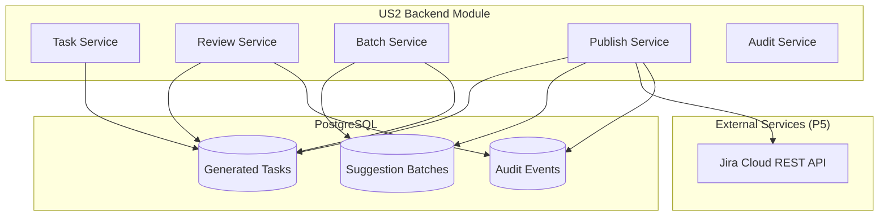
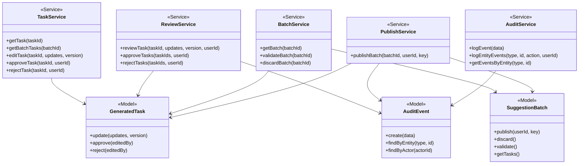

# Development Specification - US2 Backend Module

## 1. Header

**Version:** 2.0 (P4 Implementation)
**Date:** March, 2026
**Project Name:** AI-Enhanced Project Workflow Manager
**Document Status:** Final

**Related User Story:**
As a project lead, I want to review and edit AI-generated tasks before publishing them so that I stay in control of final decisions.

**Dependency**: US2 depends on US1 - requires persisted SuggestionBatch and GeneratedTask records.

**Backend Reference**: Harmonized Backend Specification (dev-spec-4-harmonized-backend.md)

## 2. Architecture

### 2.1 Module Overview

The US2 Backend Module handles:
1. Task retrieval and display
2. Task editing with optimistic locking
3. Task approval and rejection
4. Batch validation before publishing
5. Task publishing to Jira (mocked in P4)
6. Audit logging of all operations

### 2.2 Module Architecture Diagram



### 2.3 Component Deployment

| Component | Deployment | Dependencies |
|-----------|------------|--------------|
| Task Service | Backend API | PostgreSQL |
| Review Service | Backend API | PostgreSQL, Audit |
| Batch Service | Backend API | PostgreSQL |
| Publish Service | Backend API | PostgreSQL, Jira (P5) |
| Audit Service | Backend API | PostgreSQL |

### 2.4 Information Flow

```
User (JWT authenticated)
  ↓ Fetch batch and tasks
Batch Service
  ↓ Retrieve from database
User → View tasks
  ↓ Edit task
Review Service
  ↓ Update with optimistic locking
  ↓ Create audit event
  ↓ Approve/Reject
  ↓ Update status
  ↓ Create audit event
User → Validate batch
  ↓ Check validation
Batch Service
  ↓ Return validation result
User → Publish batch
Publish Service
  ↓ Get approved tasks
  ↓ Call Jira (mocked)
  ↓ Update batch status
  ↓ Update tasks with Jira IDs
  ↓ Create audit event
```

## 3. Class Diagram (US2 Module)

```mermaid
classDiagram
    class TaskService {
        +getTask(taskId) Promise~Task~
        +getBatchTasks(batchId) Promise~Task[]~
        +editTask(taskId, updates, version) Promise~Task~
        +approveTask(taskId, userId) Promise~Task~
        +rejectTask(taskId, userId) Promise~Task~
        +bulkUpdate(taskIds, status, userId) Promise~Count~
    }

    class ReviewService {
        +reviewTask(taskId, updates, version, userId) Promise~Task~
        +approveTasks(taskIds, userId) Promise~Result~
        +rejectTasks(taskIds, userId) Promise~Result~
        -checkVersion(expectedVersion, actualVersion) void
    }

    class BatchService {
        +getBatch(batchId) Promise~Batch~
        +validateBatch(batchId) Promise~Validation~
        +discardBatch(batchId) Promise~boolean~
        -getApprovedCount(batchId) int
        -getDraftCount(batchId) int
        -getRejectedCount(batchId) int
    }

    class PublishService {
        +publishBatch(batchId, userId, idempotencyKey) Promise~Result~
        -checkIdempotency(batchId, idempotencyKey) boolean
        -getApprovedTasks(batchId) Promise~Task[]~
        -callJira(tasks) Promise~Result~
        -updateBatchAndTasks(batchId, userId, idempotencyKey, jiraResults) void
    }

    class AuditService {
        +logEvent(data) Promise~AuditEvent~
        +logEntityEvents(type, id, action, userId, diff) Promise~AuditEvent[]
        +getEventsByEntity(type, id) Promise~AuditEvent[]~
        +getEventsByActor(actorId) Promise~AuditEvent[]~
    }

    TaskService --> Tasks
    ReviewService --> Tasks
    ReviewService --> Audit
    BatchService --> Batches
    BatchService --> Tasks
    PublishService --> Tasks
    PublishService --> Batches
    PublishService --> Jira
    PublishService --> Audit
    AuditService --> Audit
```



## 4. Data Abstraction

### 4.1 Task Abstraction (Review/Edit)

**Purpose**: Manage task review and editing workflow

**Operations**:
- `getTask(taskId)`: Retrieve task by ID
- `getBatchTasks(batchId)`: Retrieve all tasks in batch
- `editTask(taskId, updates, version)`: Edit task with optimistic locking
- `approveTask(taskId, userId)`: Approve task for publishing
- `rejectTask(taskId, userId)`: Reject task
- `bulkUpdate(taskIds, status, userId)`: Bulk approve/reject

**Invariants**:
- Version must match for updates (optimistic locking)
- Status transitions: DRAFT → APPROVED/REJECTED
- APPROVED tasks can still be edited
- Audit event created for every change

### 4.2 Batch Abstraction (Validation/Publish)

**Purpose**: Manage batch validation and publishing

**Operations**:
- `getBatch(batchId)`: Retrieve batch by ID
- `validateBatch(batchId)`: Validate before publishing
- `discardBatch(batchId)`: Discard batch without publishing
- `getApprovedTasks(batchId)`: Retrieve approved tasks

**Invariants**:
- Batch status must be DRAFT to publish
- At least one task must be approved
- Idempotency key prevents duplicate publishes
- Publishing updates batch status to PUBLISHED

### 4.3 Publish Abstraction

**Purpose**: Handle publishing workflow with idempotency

**Operations**:
- `publishBatch(batchId, userId, idempotencyKey)`: Publish approved tasks
- `checkIdempotency(batchId, idempotencyKey)`: Check if already published
- `getApprovedTasks(batchId)`: Get tasks to publish
- `callJira(tasks)`: Call Jira API (mocked in P4)
- `updateBatchAndTasks(batchId, userId, idempotencyKey, jiraResults)`: Update after publish

**Invariants**:
- Only approved tasks are published
- Idempotency key ensures one publish per request
- Batch stores last published idempotency key
- Jira issue IDs stored in task records
- Transactional updates (batch + tasks)

### 4.4 Audit Abstraction

**Purpose**: Log all changes for accountability

**Operations**:
- `logEvent(data)`: Log a single audit event
- `logEntityEvents(type, id, action, userId, diff)`: Log entity changes
- `getEventsByEntity(type, id)`: Get audit trail for entity
- `getEventsByActor(actorId)`: Get user's actions

**Invariants**:
- Append-only log (no updates/deletes)
- Every action creates an audit event
- Includes request ID for tracing
- Stores diff of changes

## 5. Stable Storage

### 5.1 PostgreSQL Tables (Shared with US1)

**SuggestionBatches Table**:
- Status: DRAFT → PUBLISHED/DISCARDED
- Idempotency key for duplicate prevention
- Published by and timestamp

**GeneratedTasks Table**:
- Status: DRAFT → APPROVED/REJECTED
- Version for optimistic locking
- Jira issue ID/key after publish
- Last edited by and timestamp

**AuditEvents Table**:
- Entity type and ID
- Action (UPDATE, APPROVE, REJECT, PUBLISH, DISCARD)
- Actor ID
- Timestamp
- Diff (changes)
- Request ID

### 5.2 Storage Mechanism

**Choice**: PostgreSQL relational database (shared with US1)

**Justification**:
- Same database as US1 for consistency
- ACID transactions for publish operations
- Foreign key constraints ensure integrity
- Indexes for audit queries
- Supports concurrent access with locking

**Transaction Support**:
- Publish operations use transactions
- Batch update + task updates in single transaction
- Rollback on failure prevents inconsistent state

## 6. API Specification

### 6.1 Task Retrieval Endpoints

#### GET /api/tasks/batches/:batchId
**Purpose**: Get all tasks in a batch (review workflow)

**Request Headers**:
```
Authorization: Bearer <access-token>
```

**Response** (200):
```json
{
  "batch": {
    "id": "uuid",
    "document_id": "uuid",
    "status": "DRAFT",
    "created_by": "uuid",
    "created_at": "2026-03-22T..."
  },
  "tasks": [
    {
      "id": "uuid",
      "batch_id": "uuid",
      "task_type": "story",
      "title": "Implement feature",
      "description": "Description",
      "acceptance_criteria": ["Criterion 1"],
      "status": "DRAFT",
      "version": 1,
      ...
    }
  ],
  "requestId": "req_...",
  "timestamp": "2026-03-22T..."
}
```

#### GET /api/tasks/:taskId
**Purpose**: Get a specific task

**Response** (200):
```json
{
  "task": {
    "id": "uuid",
    "task_type": "story",
    "title": "Implement feature",
    "description": "Description",
    "acceptance_criteria": ["Criterion 1"],
    "status": "DRAFT",
    "version": 1,
    ...
  },
  "requestId": "req_...",
  "timestamp": "2026-03-22T..."
}
```

### 6.2 Task Edit Endpoints

#### PATCH /api/tasks/:taskId
**Purpose**: Edit a task with optimistic locking

**Request Headers**:
```
Authorization: Bearer <access-token>
```

**Request Body**:
```json
{
  "version": 1,
  "title": "Updated title",
  "description": "Updated description",
  "acceptance_criteria": ["Criterion 1", "Criterion 2"],
  "size": "M",
  "suggested_priority": "P1"
}
```

**Response** (200):
```json
{
  "task": {
    "id": "uuid",
    "task_type": "story",
    "title": "Updated title",
    "description": "Updated description",
    "acceptance_criteria": ["Criterion 1", "Criterion 2"],
    "status": "DRAFT",
    "version": 2,
    "last_edited_by": "uuid",
    "last_edited_at": "2026-03-22T...",
    ...
  },
  "requestId": "req_...",
  "timestamp": "2026-03-22T..."
}
```

**Error Response** (409):
```json
{
  "error": "Update failed: task was modified by another user. Please refresh and try again.",
  "code": "VERSION_CONFLICT",
  "timestamp": "2026-03-22T...",
  "requestId": "req_..."
}
```

### 6.3 Task Approval/Rejection Endpoints

#### POST /api/tasks/:taskId/approve
**Purpose**: Approve a task

**Request Headers**:
```
Authorization: Bearer <access-token>
```

**Response** (200):
```json
{
  "task": {
    "id": "uuid",
    "status": "APPROVED",
    "last_edited_by": "uuid",
    "last_edited_at": "2026-03-22T...",
    ...
  },
  "requestId": "req_...",
  "timestamp": "2026-03-22T..."
}
```

#### POST /api/tasks/:taskId/reject
**Purpose**: Reject a task

**Response** (200):
```json
{
  "task": {
    "id": "uuid",
    "status": "REJECTED",
    "last_edited_by": "uuid",
    "last_edited_at": "2026-03-22T...",
    ...
  },
  "requestId": "req_...",
  "timestamp": "2026-03-22T..."
}
```

#### POST /api/tasks/batches/:batchId/bulk-update
**Purpose**: Bulk approve or reject tasks

**Request Headers**:
```
Authorization: Bearer <access-token>
```

**Request Body**:
```json
{
  "taskIds": ["uuid1", "uuid2", "uuid3"],
  "action": "approve"
}
```

**Response** (200):
```json
{
  "updatedCount": 3,
  "action": "approve",
  "requestId": "req_...",
  "timestamp": "2026-03-22T..."
}
```

### 6.4 Batch Validation Endpoint

#### POST /api/tasks/batches/:batchId/validate
**Purpose**: Validate batch before publishing

**Request Headers**:
```
Authorization: Bearer <access-token>
```

**Response** (200):
```json
{
  "valid": true,
  "errors": [],
  "approved_count": 5,
  "draft_count": 2,
  "rejected_count": 1,
  "requestId": "req_...",
  "timestamp": "2026-03-22T..."
}
```

**Error Response** (400):
```json
{
  "error": "Cannot publish batch",
  "validation": {
    "valid": false,
    "errors": [
      "No approved tasks to publish. Please approve at least one task.",
      "2 task(s) are still in DRAFT status and will not be published"
    ],
    "approved_count": 0,
    "draft_count": 2,
    "rejected_count": 1
  },
  "requestId": "req_...",
  "timestamp": "2026-03-22T..."
}
```

### 6.5 Batch Publish Endpoint

#### POST /api/tasks/batches/:batchId/publish
**Purpose**: Publish approved tasks (US2 - publish workflow)

**Request Headers**:
```
Authorization: Bearer <access-token>
```

**Request Body**:
```json
{
  "idempotency_key": "unique-key-123",
  "options": {
    "dryRun": false
  }
}
```

**Response** (200):
```json
{
  "published": true,
  "publishedCount": 5,
  "issues": [
    {
      "id": "uuid",
      "jiraId": "ABC-1234",
      "key": "ABC-1234",
      "title": "Implement feature",
      "status": "BACKLOG",
      "projectKey": "ABC",
      "created": "2026-03-22T..."
    }
  ],
  "requestId": "req_...",
  "timestamp": "2026-03-22T..."
}
```

**Error Response** (503):
```json
{
  "error": "Failed to publish issues to Jira",
  "code": "PUBLISH_ERR",
  "timestamp": "2026-03-22T...",
  "requestId": "req_..."
}
```

### 6.6 Batch Discard Endpoint

#### POST /api/tasks/batches/:batchId/discard
**Purpose**: Discard a batch without publishing

**Request Headers**:
```
Authorization: Bearer <access-token>
```

**Response** (200):
```json
{
  "success": true,
  "requestId": "req_...",
  "timestamp": "2026-03-22T..."
}
```

## 7. Class Declarations

### 7.1 TaskService Class

```javascript
export class TaskService {
  // Public methods
  async getTask(taskId);
  async getBatchTasks(batchId);
  async editTask(taskId, updates, expectedVersion);
  async approveTask(taskId, userId);
  async rejectTask(taskId, userId);
  static async bulkUpdate(taskIds, status, userId);
}
```

### 7.2 ReviewService Class

```javascript
export class ReviewService {
  // Public methods
  async reviewTask(taskId, updates, version, userId);
  async approveTasks(taskIds, userId);
  async rejectTasks(taskIds, userId);

  // Private methods
  #checkVersion(expectedVersion, actualVersion);
}
```

### 7.3 BatchService Class

```javascript
export class BatchService {
  // Public methods
  async getBatch(batchId);
  async validateBatch(batchId);
  async discardBatch(batchId);
  async getApprovedTasks(batchId);

  // Private methods
  #getApprovedCount(batchId);
  #getDraftCount(batchId);
  #getRejectedCount(batchId);
}
```

### 7.4 PublishService Class

```javascript
export class PublishService {
  // Public methods
  async publishBatch(batchId, userId, idempotencyKey, options);

  // Private methods
  async #checkIdempotency(batchId, idempotencyKey);
  async #getApprovedTasks(batchId);
  async #callJira(tasks, options);
  async #updateBatchAndTasks(batchId, userId, idempotencyKey, jiraResults);
}
```

### 7.5 AuditService Class

```javascript
export class AuditService {
  // Public methods
  static async logEvent(data);
  static async logEntityEvents(type, id, action, userId, diff);
  static async getEventsByEntity(type, id);
  static async getEventsByActor(actorId);
  static async getEventsByRequestId(requestId);
}
```

## 8. Module Hierarchy Diagram



## 9. Testing

### 9.1 Unit Tests

- Task edit with optimistic locking
- Task approval and rejection
- Batch validation logic
- Idempotent publishing
- Audit event creation

### 9.2 Integration Tests

- Complete review workflow
- Batch validation with errors
- Publish workflow (success and failure)
- Bulk operations
- Version conflict scenarios

### 9.3 End-to-End Tests

- Complete US2 workflow:
  1. Fetch batch and tasks
  2. Edit tasks (with version checks)
  3. Approve/reject tasks
  4. Validate batch
  5. Publish batch
  6. Verify audit events
  7. Verify Jira IDs stored

## 10. Summary

The US2 Backend Module implements:

1. **Task Retrieval**: Fetch tasks for review
2. **Task Editing**: Edit tasks with optimistic locking
3. **Task Approval**: Approve tasks for publishing
4. **Task Rejection**: Reject tasks from publishing
5. **Bulk Operations**: Approve/reject multiple tasks
6. **Batch Validation**: Validate before publishing
7. **Batch Publishing**: Publish approved tasks to Jira
8. **Idempotency**: Prevent duplicate publishes
9. **Audit Logging**: Track all changes
10. **Concurrent Access**: Support multiple users

**Key Features**:
- Optimistic locking prevents conflicts
- Version field enables concurrent edits
- Idempotency key prevents duplicate publishes
- Transactional updates ensure consistency
- Comprehensive audit trail for accountability
- Validation gates prevent invalid publishes

**Dependencies**:
- Depends on US1 for SuggestionBatch and GeneratedTask models
- Uses same PostgreSQL database as US1
- Shares JWT authentication with US1

The module is fully implemented in `/backend/src/routes/tasks.js` and `/backend/src/models/`.
